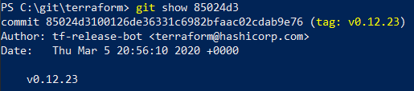

# devops-netology Плигин Сергей
## Домашнее задание к занятию «2.4. Инструменты Git»

## 1. Найдите полный хеш и комментарий коммита, хеш которого начинается на `aefea`.
## Ответ:
Командой `git show aefea` выводим полный хэш и комментарий коммита:
`commit aefead2207ef7e2aa5dc81a34aedf0cad4c32545`
`Update CHANGELOG.md` 
  

## 2. Какому тегу соответствует коммит `85024d3`?
## Ответ:
Посмотреть, какому тегу соответствует коммит `85024d3` можно командой `git show 85024d3`. Справа от хэша коммита в круглых скобках будет указан тэг `tag: v0.12.23` 
  
Так же соответствие коммита тэгу можно посмотреть командой `git tag --points-at 85024d3` 
  

## 3. Сколько родителей у коммита `b8d720`? Напишите их хеши.
## Ответ:
Определить, сколько родителей у коммита `b8d720` можно несколькими способами. 
1) Командой `git show b8d720` выводим информацию о коммите.  
  
Так ка это merge коммит, то у него всего два родителя `56cd7859e 9ea88f22f`.  
Далее командой `git show` выводим полные хеши родителей `56cd7859e05c36c06b56d013b55a252d0bb7e158` и `9ea88f22fc6269854151c571162c5bcf958bee2b` 
  
  
2) Командой `git show -s --format=%P b8d720` выведем хеши родительских коммитов  
`56cd7859e05c36c06b56d013b55a252d0bb7e158 9ea88f22fc6269854151c571162c5bcf958bee2b`  
  
## 4. Перечислите хеши и комментарии всех коммитов которые были сделаны между тегами v0.12.23 и v0.12.24.
## Ответ:
Командой `git log v0.12.23..v0.12.24 --oneline` выводим все хеши и комментарии между тегами 
`33ff1c03b (tag: v0.12.24) v0.12.24` 
`b14b74c49 [Website] vmc provider links` 
`3f235065b Update CHANGELOG.md` 
`6ae64e247 registry: Fix panic when server is unreachable` 
`5c619ca1b website: Remove links to the getting started guide's old location` 
`06275647e Update CHANGELOG.md` 
`d5f9411f5 command: Fix bug when using terraform login on Windows` 
`4b6d06cc5 Update CHANGELOG.md` 
`dd01a3507 Update CHANGELOG.md` 
`225466bc3 Cleanup after v0.12.23 release` 
  
## 5. Найдите коммит в котором была создана функция `func providerSource`, ее определение в коде выглядит так `func providerSource(...)` (вместо троеточего перечислены аргументы).
## Ответ:
Используем команду `git log -S "func providerSource" --pretty=format:"%h %ad %s"` для ображения коммитов, где упоминается искомая функция. 
`5af1e6234 Tue Apr 21 16:28:59 2020 -0700 main: Honor explicit provider_installation CLI config when present` 
`8c928e835 Thu Apr 2 18:04:39 2020 -0700 main: Consult local directories as potential mirrors of providers` 
По дате самым ранним является коммит с хешем `8c928e835`, следовательно в нем была создана функция. 
## 6. Найдите все коммиты в которых была изменена функция `globalPluginDirs`.
Выполняем команду `git grep "globalPluginDirs"`. В выводе команды видим, что функция описана в файле `plugins.go` 
`plugins.go:func globalPluginDirs() []string {` 
Командой `git log -L :'func globalPluginDirs':plugins.go` показываем лог c коммитами, где эта функция была изменена. 
`78b122055 Remove config.go and update things using its aliases` 
`52dbf9483 keep .terraform.d/plugins for discovery` 
`41ab0aef7 Add missing OS_ARCH dir to global plugin paths` 
`66ebff90c move some more plugin search path logic to command` 
## 7. Кто автор функции `synchronizedWriters`?
## Ответ:
Командой `git log -S "synchronizedWriters" --pretty=format:"%h %an %ae"` находим автора функции. 
`5ac311e2a Martin Atkins mart@degeneration.co.uk` 
Посмотрев коммит командой `git show 5ac311e2a` можно убедиться, что функция добавлена этим автором.

