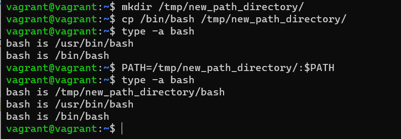

# devops-netology Плигин Сергей
## Домашнее задание к занятию "3.1. Работа в терминале, лекция 1"

 #### 1. Установите средство виртуализации [Oracle VirtualBox](https://www.virtualbox.org/).

#### 2. Установите средство автоматизации [Hashicorp Vagrant](https://www.vagrantup.com/).
#### Решение:
Установка VirtualBox и Vagrant производилась в ОС Windows, скачаны и проинсталлированы соответствующие установщики в ОС.
#### 3. В вашем основном окружении подготовьте удобный для дальнейшей работы терминал.
#### Решение:
Для дальнейшей работы выбран Windows Terminal в Windows. Цветовая схема, размер окна, шрифтов и т.д. выбраны стандартные.
#### 4. С помощью базового файла конфигурации запустите Ubuntu 20.04 в VirtualBox посредством Vagrant.
#### Решение:
Создана отдельная директория и в ней выполнена команда `vagrant init`. Содержимое Vagrantfile по умолчанию изменено на предлагаемое в задании. С помощью команды `vagrant up` запущена Ubuntu 20.04 в VirtualBox.
#### 5. Ознакомьтесь с графическим интерфейсом VirtualBox, посмотрите как выглядит виртуальная машина, которую создал для вас Vagrant, какие аппаратные ресурсы ей выделены. Какие ресурсы выделены по-умолчанию?
#### Решение:
Выделены следующие ресурсы: 
Оперативная память: 1024 МБ 
Процессоры: 2 
HDD: 64 ГБ 
Видеопамять: 4 МБ 
Сетевой адаптер: 1
#### 6. Ознакомьтесь с возможностями конфигурации VirtualBox через Vagrantfile: документация. Как добавить оперативной памяти или ресурсов процессора виртуальной машине?
#### Решение:
Добавлением комманд в VagrantFile: 
    `v.memory = 2048` 
    `v.cpus = 2` 
или командами утилиты VBoxManage 
   `config.vm.provider "virtualbox" do |vb|` 
    `vb.memory = "2048"` 
    `vb.cpu = "2"` 
   `end`
#### 7. Команда vagrant ssh из директории, в которой содержится Vagrantfile, позволит вам оказаться внутри виртуальной машины без каких-либо дополнительных настроек. Попрактикуйтесь в выполнении обсуждаемых команд в терминале Ubuntu.
Выполнено.
#### 8. Ознакомиться с разделами man bash, почитать о настройках самого bash:
####какой переменной можно задать длину журнала history, и на какой строчке manual это описывается?
#### Решение:
1. `HISTFILESIZE` - максимальное число строк в файле истории для сохранения. В моем случае строка 721
2. `HISTSIZE` - число команд для сохранения. В моем случае строка 733.
####что делает директива ignoreboth в bash?
#### Решение:
`ignoreboth` это сокращение для 2х директив `ignorespace` и`ignoredups`, 
    `ignorespace` - не сохранять команды начинающиеся с пробела, 
    `ignoredups` - не сохранять команду, если такая уже имеется в истории
#### 9. В каких сценариях использования применимы скобки {} и на какой строчке man bash это описано?
#### Решение:
`{}` - зарезервированные слова, список, в т.ч. список команд, которые исполнятся в текущей среде оболочки, 
используется в различных условных циклах, условных операторах, или ограничивает тело функции, 
В командах выполняет подстановку элементов из списка , если упрощенно то  цикличное выполнение команд с подстановкой. 
В моем случае строка 257.
#### 10. С учётом ответа на предыдущий вопрос, как создать однократным вызовом touch 100000 файлов? Получится ли аналогичным образом создать 300000? Если нет, то почему?
#### Решение:
`touch {000001..100000}.txt` - создаст в текущей директории соответсвующее число файлов. 
300000 файлов создать не получится, список аргументов слишком длинный. Максимальное число файлов, полученное экспериментально - 110251.
#### 11. В man bash поищите по `/\[\[`. Что делает конструкция `[[ -d /tmp ]]`
#### Решение:
Конструкция `[[ -d /tmp ]]` проверяет, существует ли `tmp` и является ли он директорией и возвратит статус `0` или `1`
#### 12. Основываясь на знаниях о просмотре текущих (например, PATH) и установке новых переменных; командах, которые мы рассматривали, добейтесь в выводе type -a bash в виртуальной машине наличия первым пунктом в списке:
#### Решение:
  
#### 13. Чем отличается планирование команд с помощью batch и at?
#### Решение:
`at` - команда запускается в указанное время
`batch` - запускается когда уровень загрузки системы снизится ниже 1.5.
#### 14. Завершите работу виртуальной машины чтобы не расходовать ресурсы компьютера и/или батарею ноутбука.
#### Решение:
Выполнено командой `vagrant suspend`.