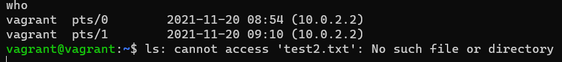

# devops-netology Плигин Сергей
## Домашнее задание к занятию "3.2. Работа в терминале, лекция 2"

#### 1. Какого типа команда `cd`? Попробуйте объяснить, почему она именно такого типа; опишите ход своих мыслей, если считаете что она могла бы быть другого типа.
#### Решение:
Команда `cd` - это встроенная команда оболочки bash, а не отдельная программа или системный вызов.  
Если бы `cd` была отдельной программой, то она меняла бы директорию только для своего процесса, а не для всей оболочки.
#### 2. Какая альтернатива без `pipe` команде `grep <some_string> <some_file> | wc -l?` `man grep` поможет в ответе на этот вопрос. Ознакомьтесь с документом о других подобных некорректных вариантах использования `pipe`.
#### Решение:
Альтернативной будет команда `grep <some_string> <some_file> -c`  
Пример:  
  
#### 3. Какой процесс с PID 1 является родителем для всех процессов в вашей виртуальной машине Ubuntu 20.04?
#### Решение:
Процесс systemd с PID 1 является родителем для всех процессов. 

#### 4. Как будет выглядеть команда, которая перенаправит вывод stderr ls на другую сессию терминала?
#### Решение:
Для перенаправления нужно будет указать дескриптор 2 (stderr) и путь к другой сессии терминала:
`ls test2.txt 2>/dev/pts/1` 
Узнаем список сессий командой `who` 
 
Перенаправляем вывод stderr 
 
В другой сессии терминала наблюдаем вывод ошибок 

#### 5. Получится ли одновременно передать команде файл на stdin и вывести ее stdout в другой файл? Приведите работающий пример.
#### Решение:
Получится следующим `command < input-file > output-file` 

#### 6. Получится ли находясь в графическом режиме, вывести данные из PTY в какой-либо из эмуляторов TTY? Сможете ли вы наблюдать выводимые данные?
#### Решение:
Выводить данные будем с помощью перенаправления. 
На виртуальной машине в VirtualBox передадим вывод ошибок в Windows Terminal 
 
В Windows Terminal увидим вывод ошибки: 
 
#### 7. Выполните команду `bash 5>&1`. К чему она приведет? Что будет, если вы выполните `echo netology > /proc/$$/fd/5`? Почему так происходит?
#### Решение:
Командой `bash 5>&1` мы создаем файловый дескриптор 5 и перенаправляем его в стандартый вывод (stdout). 
Командой `echo netology > /proc/$$/fd/5` мы передаем дескриптору 5 значение netology и выводим его на экран. 
Если заранее не создать дескриптор 5, а попытаться сразу ввести команду `echo netology > /proc/$$/fd/5`, то получим ошибку, так как дескриптора 5 не существует.
#### 8. Получится ли в качестве входного потока для pipe использовать только stderr команды, не потеряв при этом отображение stdout на pty?
#### Решение:
`echo "test" 3>&1 1>&2 2>&3 | wc -l`  
Необходимо создать свой дескриптор 3 и перенаправить его в дескриптор 1 (stdout), дескриптор 1 перенаправим в дескриптор 2 (stderr), дескриптор 2 перенаправим в наш дескриптор 3.  Через `pipe` на вход мы будем получать `stderr`, но и сохраним `stdout`.  
  
`stdout` вывел `test`, `wc-l` вывел 0 строк в `srderr`.
#### 9. Что выведет команда `cat /proc/$$/environ`? Как еще можно получить аналогичный по содержанию вывод?
#### Решение:
Команда выводит значения переменных. Аналогичная команда `env`.
#### 10. Используя `man`, опишите что доступно по адресам `/proc/<PID>/cmdline`, `/proc/<PID>/exe`
#### Решение:
`/proc/<PID>/cmdline` - это файл только для чтения, который содержит полную командную строку запуска процесса, кроме процессов-зомби (процессов завершивших своё выполнение, но ещё присутствующих в списке процессов ОС). 
`/proc/<PID>/exe` - под Linux 2.2 и выше это символьная ссылка, содержащая фактическое полное имя выполняемого файла. 
Под Linux 2.0 и ниже является указателем на запущенный файл и является символьной ссылкой.
#### 11. Узнайте, какую наиболее старшую версию набора инструкций SSE поддерживает ваш процессор с помощью /proc/cpuinfo
#### Решение:
Наиболее старшая версия наборов инструкций, которую поддерживает мой процессор - `sse4_2` 
Посмотреть можно либо командой `cat /proc/cpuinfo` тем самым выведя в терминал все параметры, либо поискать по значению `sse` командой `grep sse /proc/cpuinfo`  
#### 12. При открытии нового окна терминала и vagrant ssh создается новая сессия и выделяется pty. Это можно подтвердить командой tty, которая упоминалась в лекции 3.2. Однако: `vagrant@netology1:~$ ssh localhost 'tty' not a tty` Почитайте, почему так происходит, и как изменить поведение.
#### Решение:
По умолчанию, когда вы запускаете команду на удаленном компьютере с помощью `ssh`, `TTY` не выделяется для удаленного сеанса. 
В `man ssh` написано, что ключ `-t` форсирует запуск `tty`, даже если `ssh` не имеет локального `tty`. 
То есть необходимо запускать такой командой `ssh -t localhost 'tty'`.
#### 13. Бывает, что есть необходимость переместить запущенный процесс из одной сессии в другую. Попробуйте сделать это, воспользовавшись `reptyr`. Например, так можно перенести в `screen` процесс, который вы запустили по ошибке в обычной SSH-сессии.
#### Решение:
Командой `reptyr` пользовался по документации [https://github.com/nelhage/reptyr](https://github.com/nelhage/reptyr)
. 
В итоге получилось отсоединить процесс и вывести его во вторую сессию. Так же столкнулся с ошибкой `Unable to attach to pid ###: Operation not permitted`. 
После изменения в `/proc/sys/kernel/yama/ptrace_scope` значения `kernel.yama.ptrace_scope` с `1` на `0` перенести процесс получилось.
#### 14. `sudo echo string > /root/new_file` не даст выполнить перенаправление под обычным пользователем, так как перенаправлением занимается процесс shell'а, который запущен без `sudo` под вашим пользователем. Для решения данной проблемы можно использовать конструкцию `echo string | sudo tee /root/new_file`. Узнайте что делает команда `tee` и почему в отличие от `sudo echo` команда с `sudo tee` будет работать.
#### Решение: 
Команда `tee` читает из стандартного ввода (stdin) и записывает в стандартный вывод (stdout) и в файлы. Под `sudo` она будет иметь доступ к файлу на запись. 
