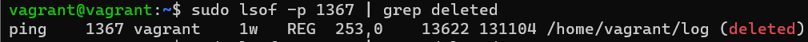
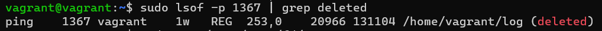
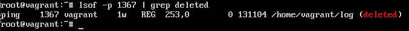
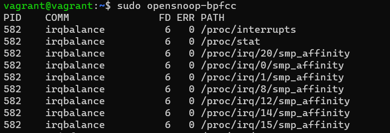

# devops-netology Плигин Сергей
## Домашнее задание к занятию "3.3. Операционные системы, лекция 1"

#### 1. Какой системный вызов делает команда `cd`?
#### Решение:
Выполняем команду `strace /bin/bash -c 'cd /tmp'`.
В выводе находим системный вызов команды `cd` - это `chdir("/tmp")`
#### 2. Попробуйте использовать команду file на объекты разных типов на файловой системе.... Используя strace выясните, где находится база данных file на основании которой она делает свои догадки.
#### Решение:
База данных команды file на основании которой она делает свои догадки находится по следующему пути:   
`/usr/share/misc/magic.mgc`
#### 3. Предположим, приложение пишет лог в текстовый файл. Этот файл оказался удален (deleted в lsof), однако возможности сигналом сказать приложению переоткрыть файлы или просто перезапустить приложение – нет. Так как приложение продолжает писать в удаленный файл, место на диске постепенно заканчивается. Основываясь на знаниях о перенаправлении потоков предложите способ обнуления открытого удаленного файла (чтобы освободить место на файловой системе).
#### Решение:
Использовал команду `ping ya.ru > log`, далее Ctrl+z, далее `bg`, чтобы команда работала в фоне.  
Далее удалил файл `log`.
Нашел с помощью команды `ps aux | grep ping` PID процесса.
   
С помощью команды ` sudo lsof -p 1367 | grep deleted` нашел строку с удаленным файлом log, так же видим, что размер занимаемого им места растет при повторном выполнении команды.  
  
  
Я смог обнулить открытый удаленный файл смог только вызвав из бэкграунда процесс командой `fg ping` и затем приостановив процесс `Ctrl+z`.  
Обнулял файл командой `: > /proc/1367/fd/1`. 
После этих действий файл обнулился
 
#### 4. Занимают ли зомби-процессы какие-то ресурсы в ОС (CPU, RAM, IO)?
#### Решение:
Зомби-процессы не потребляют никаких ресурсов, память и файловые дескрипторы таких процессов уже освобождены. Остается только запись в таблице процессов, которая занимает несколько десятков байт памяти.
#### 5. На какие файлы вы увидели вызовы группы open за первую секунду работы утилиты `opensnoop`?
#### Решение:

#### 6. Какой системный вызов использует `uname -a`? Приведите цитату из `man` по этому системному вызову, где описывается альтернативное местоположение в `/proc`, где можно узнать версию ядра и релиз ОС.
#### Решение:
`uname -a` использует системный вызов uname()  
Цитата из `man`:  
`Part of the utsname information is also accessible via /proc/sys/kernel/{ostype, hostname, osrelease, version,
       domainname}.`
#### 7. Чем отличается последовательность команд через `;` и через `&&` в `bash`? Например:  
####`root@netology1:~# test -d /tmp/some_dir; echo Hi  
#### Hi  
#### root@netology1:~# test -d /tmp/some_dir && echo Hi  
#### root@netology1:~#`    
#### Есть ли смысл использовать в bash `&&`, если применить `set -e`?
#### Решение:
Оператор точка с запятой (`;`)выполняет несколько команд одновременно последовательно, и обеспечивает вывод без зависимости от успеха и отказа других команд.  
Оператор `&&` выполнит вторую команду `echo` только в том случае, если команда `test` успешно выполнена.  
Команда `set` устанавливает значения параметров оболочки, а флаг `-e` значит, что оборлочка завершит свою работу, если простая команда в списке команд завершается с ошибкой. Данный флаг `-e` не будет использоваться, если присутствуют операторы `&&`, `if`, `while`, `until`, `||`.  
Следовательно, не имеет смысла использовать в bash `&&`, если применить `set -e`.
#### 8. Из каких опций состоит режим bash `set -euxo pipefail` и почему его хорошо было бы использовать в сценариях?
#### Решение:
`set -euxo pipefail` состоит из следующих опций:  
`-e` - прекращает выполнение скрипта если команда завершилась ошибкой, выводит в stderr строку с ошибкой.  
`-u` - прекращает выполнение скрипта, если встретилась несуществующая переменная как ошибку.  
`-x` - выводит выполняемые команды в stdout перед выполнением.  
`-o` - устаналивает или снимает опцию по её длинному имени. Например `set -o pipefail`. Если никакой опции не задано, то выводится список всех опций и их статус.  
`-o pipefail` - прекращает выполнение скрипта, даже если одна из частей пайпа завершилась ошибкой.
#### 9. Используя `-o stat` для `ps`, определите, какой наиболее часто встречающийся статус у процессов в системе. В `man ps` ознакомьтесь (/PROCESS STATE CODES) что значат дополнительные к основной заглавной буквы статуса процессов. Его можно не учитывать при расчете (считать S, Ss или Ssl равнозначными).
#### Решение:
   
`S (Ss)` - interruptible sleep (обычный спящий процесс, который может быть
прерван, ожидает какого-то события);  
 `T` - остановлен сигналом управления задачами;  
`R` - running и runnable (исполняется или ожидает исполнения);