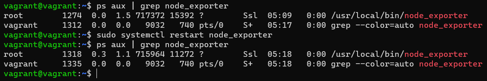

# devops-netology Плигин Сергей
## Домашнее задание к занятию "3.4. Операционные системы, лекция 2"

#### 1. На лекции мы познакомились с node_exporter. В демонстрации его исполняемый файл запускался в background. Этого достаточно для демо, но не для настоящей production-системы, где процессы должны находиться под внешним управлением. Используя знания из лекции по systemd, создайте самостоятельно простой unit-файл для node_exporter:
#### `поместите его в автозагрузку,`
#### `предусмотрите возможность добавления опций к запускаемому процессу через внешний файл (посмотрите, например, на systemctl cat cron),`
#### `удостоверьтесь, что с помощью systemctl процесс корректно стартует, завершается, а после перезагрузки автоматически поднимается.`
#### Решение:
Node_exporter установлен, в браузере доступен по ссылке  
  
создан unit-файл и помещен в автозагрузку  
  
сервис стартует, завершается и автоматически поднимается после перезагрузки OS.  
  
 

