# devops-netology Плигин Сергей
## Домашнее задание к занятию "3.5. Файловые системы"

#### 1. Узнайте о sparse (разряженных) файлах.
#### Решение:
Со статьей о sparse (разряженных) файлах ознакомился. Разряженный файл в Linux можно создать командой:  
`dd if=/dev/zero of=file-sparse bs=1 count=0 seek=2G`  
Где file-sparse – имя, и в конце указан его размер, можно задать в байтах, мегабайтах и т.д.  
Вторая команда для создания разряженного файла:  
`truncate -s2G file-sparse`  
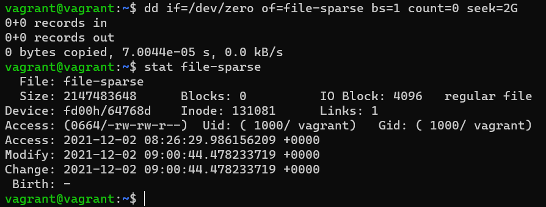 
#### 2. Могут ли файлы, являющиеся жесткой ссылкой на один объект, иметь разные права доступа и владельца? Почему?
#### Решение:
Файлы, являющиеся жесткой ссылкой на один объект не смогут иметь разные права доступа и владельца, потому что имеют ту же информацию inode и набор разрешений что и у исходного файла.
Создадим файл и жесткую ссылку на него. Видим, что права у них одинаковые:  
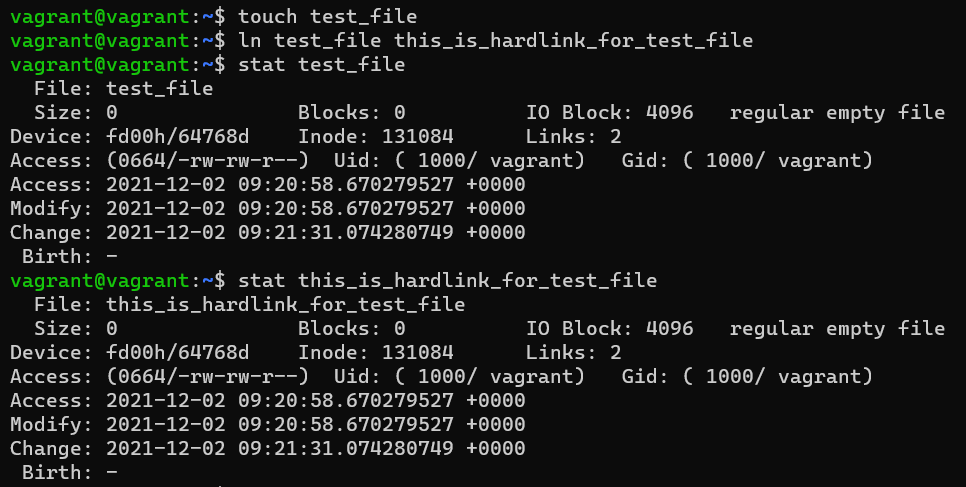  
Попробовав изменить права у жесткой ссылки, увидим, что права меняются и на объект:  
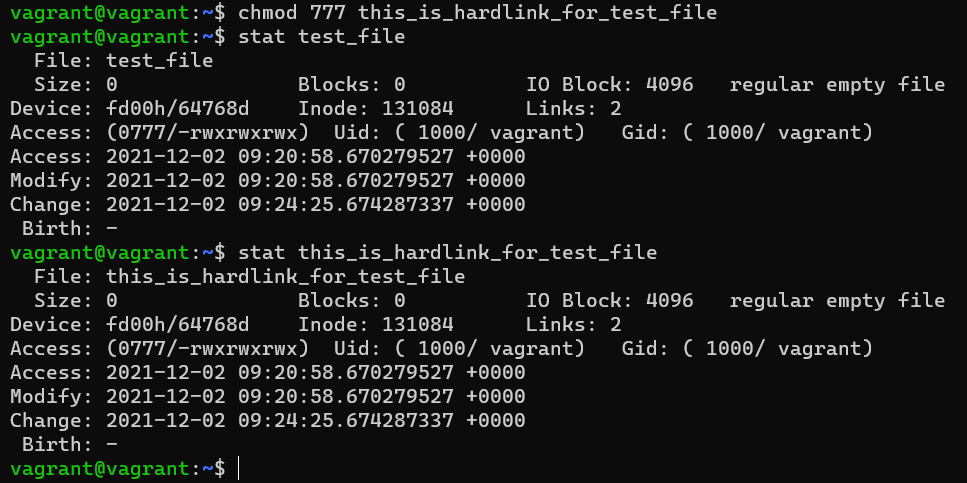 
#### 3. Сделайте vagrant destroy на имеющийся инстанс Ubuntu. Замените содержимое Vagrantfile следующим:

`Vagrant.configure("2") do |config|`  
  `config.vm.box = "bento/ubuntu-20.04"`  
  `config.vm.provider :virtualbox do |vb|`  
    `lvm_experiments_disk0_path = "/tmp/lvm_experiments_disk0.vmdk"`  
    `lvm_experiments_disk1_path = "/tmp/lvm_experiments_disk1.vmdk"`  
    `vb.customize ['createmedium', '--filename', lvm_experiments_disk0_path, '--size', 2560]`  
    `vb.customize ['createmedium', '--filename', lvm_experiments_disk1_path, '--size', 2560]`  
`    vb.customize ['storageattach', :id, '--storagectl', 'SATA Controller', '--port', 1, '--device', 0, '--type', 'hdd', '--medium', lvm_experiments_disk0_path]`  
`    vb.customize ['storageattach', :id, '--storagectl', 'SATA Controller', '--port', 2, '--device', 0, '--type', 'hdd', '--medium', lvm_experiments_disk1_path]`  
`  end`  
`end`
#### Данная конфигурация создаст новую виртуальную машину с двумя дополнительными неразмеченными дисками по 2.5 Гб.
#### Решение:
Создана новая виртуальная машина с заданными параметрами:  
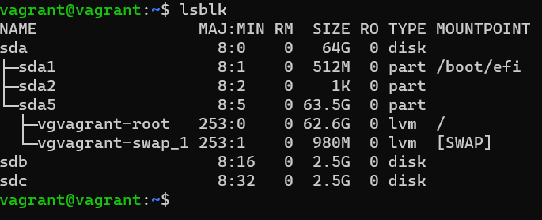 
#### 4. Используя `fdisk`, разбейте первый диск на 2 раздела: 2 Гб, оставшееся пространство.
#### Решение:
Диск sdb разбит на 2 раздела:  
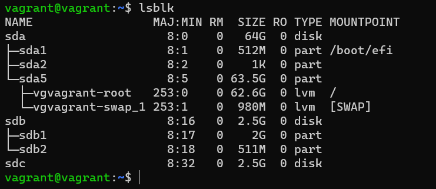 
#### 5. Используя sfdisk, перенесите данную таблицу разделов на второй диск
#### Решение:
Таблица разделов перенесена на второй диск:  
Командой `sudo sfdisk -d /dev/sdb > part_table` импортируем данные о диске с разделами в файл.
Командой `sudo sfdisk /dev/sdc < part_table` переносим таблицу разделов на диск sdc:  
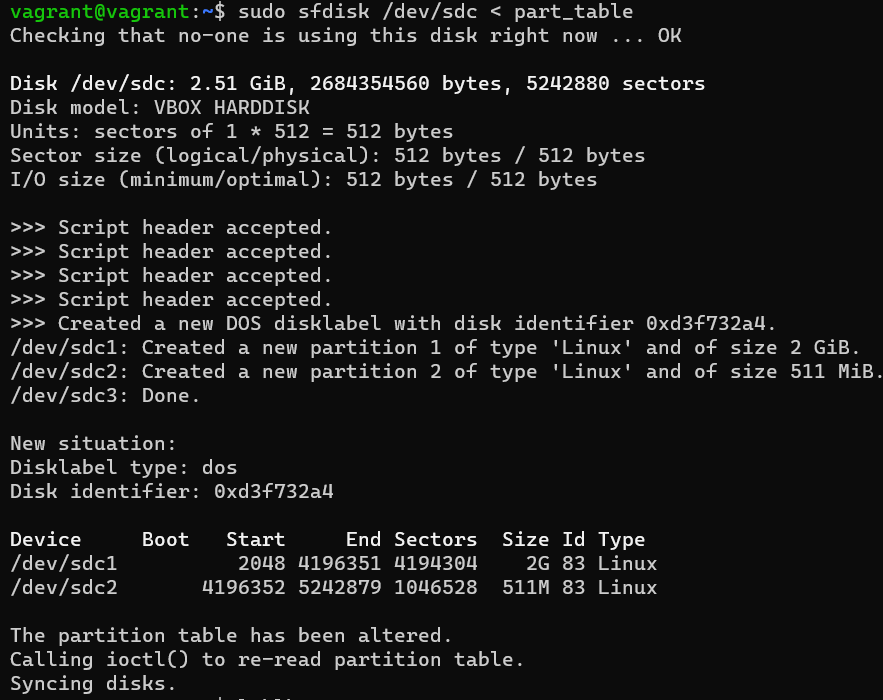  
Результат проверяем командой `lsblk`  
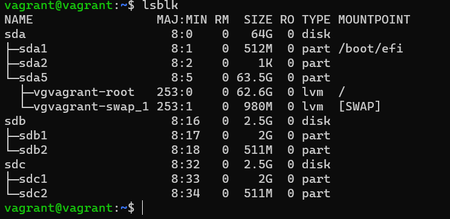 
#### 6. Соберите mdadm RAID1 на паре разделов 2 Гб.
#### Решение:
Создаем RAID1 из разделов 2 Гб командой `sudo mdadm --create /dev/md0 --level=1 --raid-devices=2 /dev/sdb1 /dev/sdc1` 
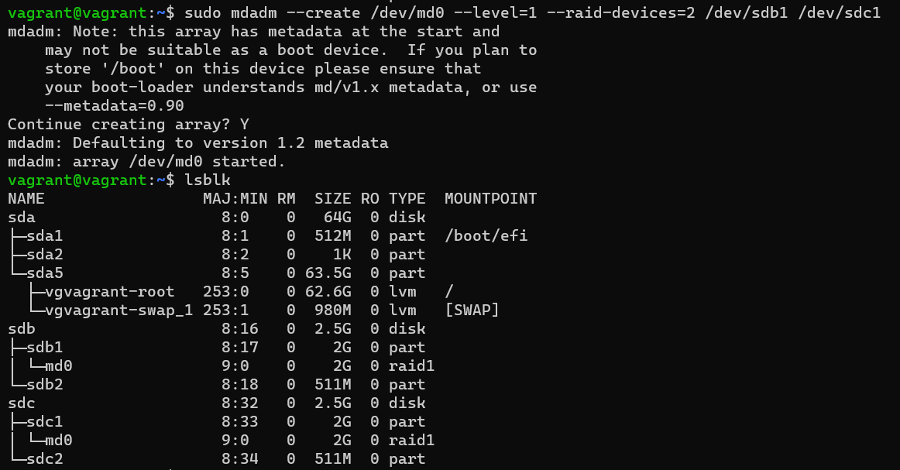  
Создан RAID1, проверяем командой `cat /proc/mdstat`  
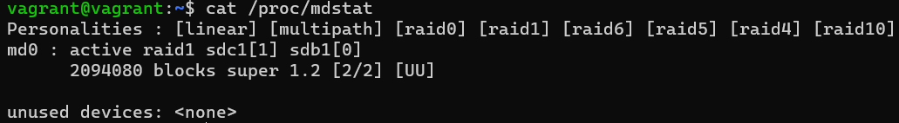 
#### 7. Соберите mdadm RAID0 на второй паре маленьких разделов.
#### Решение:
Аналогично создаем RAID0 на второй паре маленьких разделов командой `sudo mdadm --create /dev/md1 --level=0 --raid-devices=2 /dev/sdb2 /dev/sdc2`  
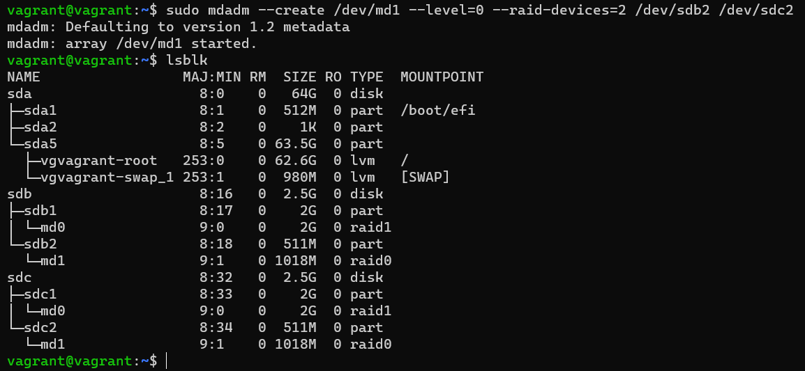 
#### 8. Создайте 2 независимых PV на получившихся md-устройствах
#### Решение:
PV создаем командами `sudo pvcreate /dev/md0` и `sudo pvcreate /dev/md1`. Проверяем командой `sudo pvscan`  
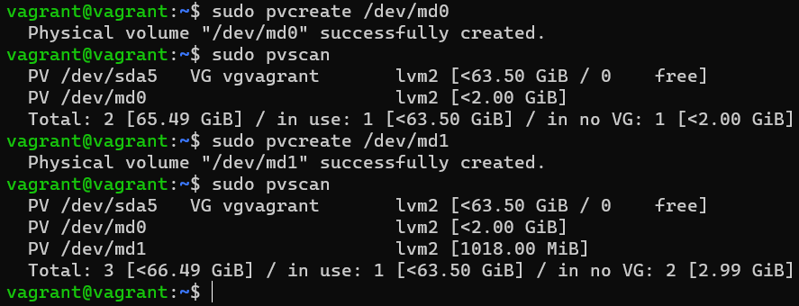 
#### 9. Создайте общую volume-group на этих двух PV.
#### Решение:
Создаем volume-group командой `sudo vgcreate vol_grp1 /dev/md0 /dev/md1`.  
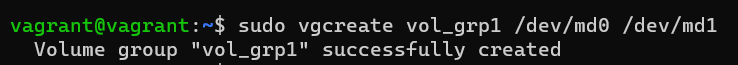  
Командой `vgdisplay` проверяем создание:  
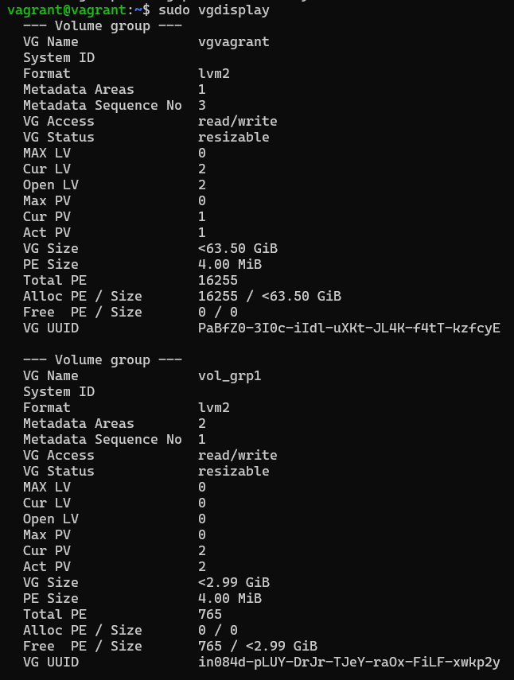 
#### 10. Создайте LV размером 100 Мб, указав его расположение на PV с RAID0.
#### Решение:
Создаем LV командой `sudo lvcreate -L 100Mb vol_grp1 /dev/md0`  
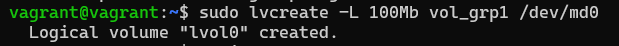  
Проверяем командой `sudo lvdisplay`  
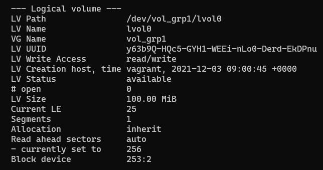 
#### 11. Создайте `mkfs.ext4` ФС на получившемся LV.
#### Решение:
Создаем командой `sudo mkfs.ext4 /dev/vol_grp1/lvol0`  
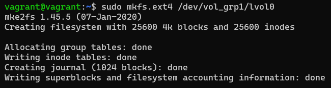 
#### 12. Смонтируйте этот раздел в любую директорию, например, /tmp/new.
#### Решение:
Создаем директорию `mkdir /tmp/new` и монтируем командой `sudo mount /dev/vol_grp1/lvol0 /tmp/new`
#### 13. Поместите туда тестовый файл, например wget https://mirror.yandex.ru/ubuntu/ls-lR.gz -O /tmp/new/test.gz.
#### Решение:
Выполнено.
#### 14. Прикрепите вывод lsblk.
#### Решение:
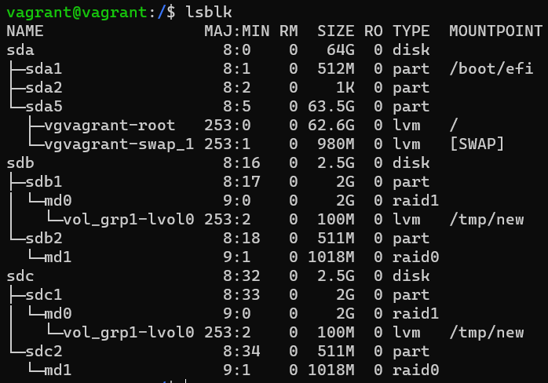 
#### 15. Протестируйте целостность файла
#### Решение:
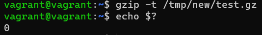 
#### 16. Используя pvmove, переместите содержимое PV с RAID0 на RAID1
#### Решение:
Переносим содержимое командой `sudo pvmove /dev/md0 /dev/md1`.  
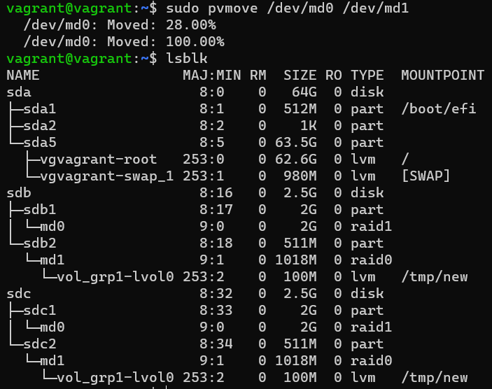 
#### 17. Сделайте --fail на устройство в вашем RAID1 md.
#### Решение:
Выполнил командой `sudo mdadm --fail /dev/md0 /dev/sdb1`  
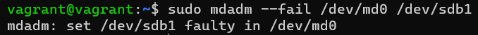 
#### 18. Подтвердите выводом dmesg, что RAID1 работает в деградированном состоянии.
#### Решение:
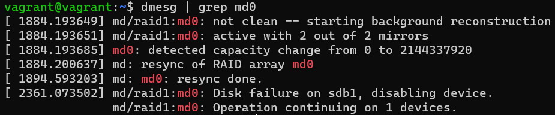 
#### 19. Протестируйте целостность файла, несмотря на "сбойный" диск он должен продолжать быть доступен
#### Решение:
 
#### 20. Погасите тестовый хост, `vagrant destroy`.
#### Решение:
Выполнено.  
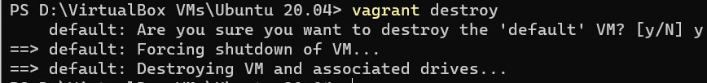

