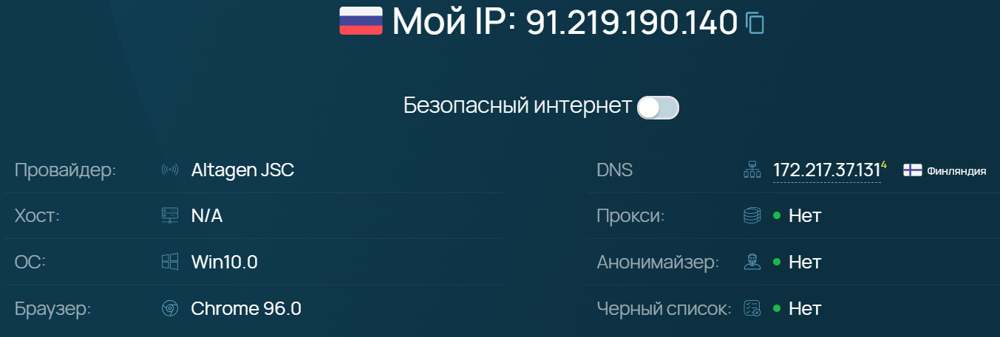

# devops-netology Плигин Сергей
## Домашнее задание к занятию "3.6. Компьютерные сети, лекция 1"

#### 1. Работа c HTTP через телнет.
- Подключитесь утилитой телнет к сайту stackoverflow.com `telnet stackoverflow.com 80`
- отправьте HTTP запрос

      GET /questions HTTP/1.0  
      HOST: stackoverflow.com  
      [press enter]  
      [press enter]  
- В ответе укажите полученный HTTP код, что он означает?
#### Решение:
Получен HTTP код `HTTP/1.1 301 Moved Permanently` - это стандартный код ответа HTTP, получаемый в ответ от сервера в ситуации, когда запрошенный ресурс был на постоянной основе перемещён в новое месторасположение, и указывающий на то, что текущие ссылки, использующие данный URL, должны быть обновлены.
#### 2. Повторите задание 1 в браузере, используя консоль разработчика F12.
- откройте вкладку Network
- отправьте запрос http://stackoverflow.com
- найдите первый ответ HTTP сервера, откройте вкладку Headers
- укажите в ответе полученный HTTP код.
- проверьте время загрузки страницы, какой запрос обрабатывался дольше всего?
- приложите скриншот консоли браузера в ответ.
#### Решение:
Получен HTTP код 200 - сервер успешно обработал запрос и передал контент обратно в браузер.  
Страница загружалась 2.7 секунд.  
  
Дольше всего загружался js-файл beacon.js - 1.86 секунды  
 
#### 3. Какой IP адрес у вас в интернете?
#### Решение:
 
#### 4. Какому провайдеру принадлежит ваш IP адрес? Какой автономной системе AS? Воспользуйтесь утилитой `whois`
#### Решение:
Мой IP адрес принадлежит провайдеру ЗАО «АЛЬТАГЕН»  

    vagrant@vagrant:~$ whois 91.219.190.140 | grep 'org-name'
    org-name:       Altagen JSC  
Автономная система AS50473

    vagrant@vagrant:~$ whois 91.219.190.140 | grep 'origin'
    origin:         AS50473
#### 5. Через какие сети проходит пакет, отправленный с вашего компьютера на адрес 8.8.8.8? Через какие AS? Воспользуйтесь утилитой `traceroute`
#### Решение:
    vagrant@vagrant:~$ traceroute -AnI 8.8.8.8  
    traceroute to 8.8.8.8 (8.8.8.8), 30 hops max, 60 byte packets  
    1  10.0.2.2 [*]  0.266 ms  0.239 ms  0.226 ms    
    2  192.168.50.1 [*]  3.775 ms  3.717 ms  3.710 ms  
    3  10.210.56.1 [*]  3.705 ms  4.300 ms  4.475 ms  
    4  10.15.0.45 [*]  3.692 ms  4.312 ms  4.290 ms  
    5  193.105.59.229 [AS50473]  12.608 ms  12.748 ms  12.727 ms  
    6  46.151.158.234 [AS50473]  7.306 ms  5.258 ms  10.037 ms  
    7  193.105.59.216 [AS50473]  5.116 ms  6.776 ms  6.939 ms  
    8  46.151.158.242 [AS50473]  6.923 ms  7.046 ms  7.030 ms  
    9  142.251.64.109 [AS15169]  5.314 ms  5.482 ms  7.017 ms  
    10  108.170.250.66 [AS15169]  7.852 ms  8.024 ms  8.020 ms  
    11  * * 142.251.49.78 [AS15169]  17.392 ms  
    12  209.85.254.6 [AS15169]  17.445 ms  17.426 ms  16.415 ms  
    13  172.253.51.239 [AS15169]  16.607 ms  17.974 ms  16.274 ms  
    14  * * *  
    15  * * *  
    16  * * *  
    17  * * *  
    18  * * *  
    19  * * *  
    20  * * *  
    21  * * *  
    22  * * *  
    23  8.8.8.8 [AS15169]  15.753 ms  16.884 ms  16.644 ms  
Список и принадлежность AS:  

    AS50473 - Altagen JSC  
    AS15169 - Google LLC
#### 6. Повторите задание 5 в утилите `mtr`. На каком участке наибольшая задержка - delay?
#### Решение:
Самая большая задержка на 1 участке (столбец Wrst, показатель 114.4)  
 
#### 7. Какие DNS сервера отвечают за доменное имя dns.google? Какие A записи? воспользуйтесь утилитой `dig`
#### Решение:
DNS сервера выводим командой `dig dns.google NS`. Список DNS серверов:  

    dns.google.             7668    IN      NS      ns1.zdns.google.
    dns.google.             7668    IN      NS      ns3.zdns.google.
    dns.google.             7668    IN      NS      ns2.zdns.google.
    dns.google.             7668    IN      NS      ns4.zdns.google.  
A записи выводим командой `dig dns.google A`. Список A записей:  

    dns.google.             275     IN      A       8.8.4.4
    dns.google.             275     IN      A       8.8.8.8
#### 8. Проверьте PTR записи для IP адресов из задания 7. Какое доменное имя привязано к IP? воспользуйтесь утилитой `dig`
#### Решение:
Быстро проверить наличие PTR записи (и, соответственно, привязанное к IP доменное имя) можно при помощи `dig -x 8.8.8.8` и `dig -x 8.8.4.4`  

    4.4.8.8.in-addr.arpa.   6984    IN      PTR     dns.google.  
    8.8.8.8.in-addr.arpa.   15102   IN      PTR     dns.google.