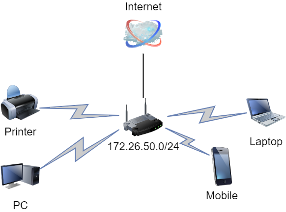

# devops-netology Плигин Сергей
## Домашнее задание к занятию "3.8. Компьютерные сети, лекция 3"

#### 1. Подключитесь к публичному маршрутизатору в интернет. Найдите маршрут к вашему публичному IP

    telnet route-views.routeviews.org
    Username: rviews
    show ip route x.x.x.x/32
    show bgp x.x.x.x/32
#### Решение:
Вывод команды `show ip route`

    route-views>show ip route 91.219.190.140
    Routing entry for 91.219.188.0/22
      Known via "bgp 6447", distance 20, metric 0
      Tag 6939, type external
      Last update from 64.71.137.241 03:04:49 ago
      Routing Descriptor Blocks:
     * 64.71.137.241, from 64.71.137.241, 03:04:49 ago
          Route metric is 0, traffic share count is 1
          AS Hops 3
          Route tag 6939
          MPLS label: none
Вывод команды `show bgp`

    route-views>show bgp 91.219.190.140
    BGP routing table entry for 91.219.188.0/22, version 1803613926
    Paths: (23 available, best #22, table default)
      Not advertised to any peer
      Refresh Epoch 3
      3303 50384 50473 50473
        217.192.89.50 from 217.192.89.50 (138.187.128.158)
          Origin IGP, localpref 100, valid, external
          Community: 3303:1004 3303:1006 3303:1030 3303:1031 3303:3081 15169:13000 31210:50384 65005:10643
          path 7FE0A8881548 RPKI State not found
          rx pathid: 0, tx pathid: 0
      Refresh Epoch 1
      20912 3257 174 31133 50473 50473 50473 50473
        212.66.96.126 from 212.66.96.126 (212.66.96.126)
          Origin IGP, localpref 100, valid, external
          Community: 3257:8070 3257:30155 3257:50001 3257:53900 3257:53902 20912:65004
          path 7FE1297292F0 RPKI State not found
          rx pathid: 0, tx pathid: 0
      Refresh Epoch 1
      3333 50384 50473 50473 50473
        193.0.0.56 from 193.0.0.56 (193.0.0.56)
          Origin IGP, localpref 100, valid, external
          Community: 15169:13000
          path 7FE1456D3780 RPKI State not found
          rx pathid: 0, tx pathid: 0
      Refresh Epoch 1
      8283 50384 50473 50473 50473
        94.142.247.3 from 94.142.247.3 (94.142.247.3)
          Origin IGP, metric 0, localpref 100, valid, external
          Community: 8283:1 8283:101 15169:13000
          unknown transitive attribute: flag 0xE0 type 0x20 length 0x18
            value 0000 205B 0000 0000 0000 0001 0000 205B
                  0000 0005 0000 0001
          path 7FE0E544B350 RPKI State not found
          rx pathid: 0, tx pathid: 0
      Refresh Epoch 1
      53767 174 31133 50473 50473 50473 50473
        162.251.163.2 from 162.251.163.2 (162.251.162.3)
          Origin IGP, localpref 100, valid, external
          Community: 174:21101 174:22028 53767:5000
          path 7FE170D3E1E8 RPKI State not found
          rx pathid: 0, tx pathid: 0
      Refresh Epoch 1
      3549 3356 3216 29076 50473 50473 50473 50473 50473
        208.51.134.254 from 208.51.134.254 (67.16.168.191)
          Origin IGP, metric 0, localpref 100, valid, external
          Community: 0:15169 3216:2001 3216:4477 3356:2 3356:22 3356:100 3356:123 3356:503 3356:903 3356:2067 3549:2581 3549:30840 29076:777 29076:900 29076:2220 29076:2230 29076:50000 29076:50030 29076:52004 29076:60495 29076:64667
          path 7FE11475C0E0 RPKI State not found
          rx pathid: 0, tx pathid: 0
      Refresh Epoch 1
      3356 3216 29076 50473 50473 50473 50473 50473
        4.68.4.46 from 4.68.4.46 (4.69.184.201)
          Origin IGP, metric 0, localpref 100, valid, external
          Community: 0:15169 3216:2001 3216:4477 3356:2 3356:22 3356:100 3356:123 3356:503 3356:903 3356:2067 29076:777 29076:900 29076:2220 29076:2230 29076:50000 29076:50030 29076:52004 29076:60495 29076:64667
          path 7FE10EA55C78 RPKI State not found
          rx pathid: 0, tx pathid: 0
      Refresh Epoch 1
      57866 1299 31133 50473 50473 50473 50473
        37.139.139.17 from 37.139.139.17 (37.139.139.17)
          Origin IGP, metric 0, localpref 100, valid, external
          Community: 1299:30000 57866:100 57866:101 57866:501
          path 7FE0299A3AE0 RPKI State not found
          rx pathid: 0, tx pathid: 0
      Refresh Epoch 1
      20130 6939 50473 50473
        140.192.8.16 from 140.192.8.16 (140.192.8.16)
          Origin IGP, localpref 100, valid, external
          path 7FE1708075E8 RPKI State not found
          rx pathid: 0, tx pathid: 0
      Refresh Epoch 1
      101 174 31133 50473 50473 50473 50473
        209.124.176.223 from 209.124.176.223 (209.124.176.223)
          Origin IGP, localpref 100, valid, external
          Community: 101:20100 101:20110 101:22100 174:21101 174:22028
          Extended Community: RT:101:22100
          path 7FE0878C65D0 RPKI State not found
          rx pathid: 0, tx pathid: 0
      Refresh Epoch 1
      852 31133 50473 50473 50473 50473
        154.11.12.212 from 154.11.12.212 (96.1.209.43)
          Origin IGP, metric 0, localpref 100, valid, external
          path 7FE14550A8A8 RPKI State not found
          rx pathid: 0, tx pathid: 0
      Refresh Epoch 1
      2497 174 31133 50473 50473 50473 50473
        202.232.0.2 from 202.232.0.2 (58.138.96.254)
          Origin IGP, localpref 100, valid, external
          path 7FE13F8BC688 RPKI State not found
          rx pathid: 0, tx pathid: 0
      Refresh Epoch 1
      4901 6079 31133 50473 50473 50473 50473
        162.250.137.254 from 162.250.137.254 (162.250.137.254)
          Origin IGP, localpref 100, valid, external
          Community: 65000:10100 65000:10300 65000:10400
          path 7FE163645A08 RPKI State not found
          rx pathid: 0, tx pathid: 0
      Refresh Epoch 1
      7660 2516 12389 29076 50473 50473 50473 50473 50473
        203.181.248.168 from 203.181.248.168 (203.181.248.168)
          Origin IGP, localpref 100, valid, external
          Community: 2516:1050 7660:9003
          path 7FE042F55078 RPKI State not found
          rx pathid: 0, tx pathid: 0
      Refresh Epoch 1
      7018 1299 31133 50473 50473 50473 50473
        12.0.1.63 from 12.0.1.63 (12.0.1.63)
          Origin IGP, localpref 100, valid, external
          Community: 7018:5000 7018:37232
          path 7FE0CFDC2028 RPKI State not found
          rx pathid: 0, tx pathid: 0
      Refresh Epoch 1
      49788 12552 50384 50473 50473 50473
        91.218.184.60 from 91.218.184.60 (91.218.184.60)
          Origin IGP, localpref 100, valid, external
          Community: 12552:12000 12552:12600 12552:12601 12552:22000
          Extended Community: 0x43:100:1
          path 7FE0CD36E078 RPKI State not found
          rx pathid: 0, tx pathid: 0
      Refresh Epoch 1
      1221 4637 5511 3216 29076 50473 50473 50473 50473 50473
        203.62.252.83 from 203.62.252.83 (203.62.252.83)
          Origin IGP, localpref 100, valid, external
          path 7FE0D6A19C88 RPKI State not found
          rx pathid: 0, tx pathid: 0
      Refresh Epoch 1
      701 1273 3216 29076 50473 50473 50473 50473 50473
        137.39.3.55 from 137.39.3.55 (137.39.3.55)
          Origin IGP, localpref 100, valid, external
          path 7FE178258088 RPKI State not found
          rx pathid: 0, tx pathid: 0
      Refresh Epoch 1
      3257 1299 31133 50473 50473 50473 50473
        89.149.178.10 from 89.149.178.10 (213.200.83.26)
          Origin IGP, metric 10, localpref 100, valid, external
          Community: 3257:8794 3257:30052 3257:50001 3257:54900 3257:54901
          path 7FE09E3CE800 RPKI State not found
          rx pathid: 0, tx pathid: 0
      Refresh Epoch 1
      3561 3910 3356 3216 29076 50473 50473 50473 50473 50473
        206.24.210.80 from 206.24.210.80 (206.24.210.80)
          Origin IGP, localpref 100, valid, external
          path 7FE0320FD240 RPKI State not found
          rx pathid: 0, tx pathid: 0
      Refresh Epoch 1
      1351 20764 20764 20764 20764 20764 20764 20764 50473 50473 50473 50473
        132.198.255.253 from 132.198.255.253 (132.198.255.253)
          Origin IGP, localpref 100, valid, external
          path 7FE10670AF98 RPKI State not found
          rx pathid: 0, tx pathid: 0
      Refresh Epoch 1
      6939 50473 50473
        64.71.137.241 from 64.71.137.241 (216.218.252.164)
          Origin IGP, localpref 100, valid, external, best
          path 7FE18B619EE8 RPKI State not found
          rx pathid: 0, tx pathid: 0x0
      Refresh Epoch 1
      19214 174 31133 50473 50473 50473 50473
        208.74.64.40 from 208.74.64.40 (208.74.64.40)
          Origin IGP, localpref 100, valid, external
          Community: 174:21101 174:22028
          path 7FE0A3FEA220 RPKI State not found
          rx pathid: 0, tx pathid: 0

#### 2. Создайте dummy0 интерфейс в Ubuntu. Добавьте несколько статических маршрутов. Проверьте таблицу маршрутизации.
#### Решение:
Создан dummy0 интерфейс. Для этого загрузил модуль `dummy` в `/etc/modules/` и указал количество возможных dummy интерфесов параметром `options dummy numdummies=2` в файле `/etc/modprobe.d/dummy.conf`  
Настройки dummy0 интерфейса в `/etc/network/interfaces`:  

    auto dummy0
    iface dummy0 inet static
    address 10.2.2.2/32
    pre-up ip link add dummy0 type dummy
    post-down ip link del dummy0

Интерфейсу eth0 в `/etc/network/interfaces` прописан маршрут при загрузке:

    auto eth0
    iface eth0 inet static
        address 192.168.1.10
        netmask 255.255.255.0
        post-up ip route add 192.168.1.0/24 via 192.168.1.1
        post-up ip route add 192.168.1.0/24 dev eth0 src 192.168.1.10

Таблица маршрутизации выглядит следующим образом:

    vagrant@vagrant:~$ ip route show
    default via 10.0.2.2 dev eth0 proto dhcp src 10.0.2.15 metric 100
    8.8.8.8 via 192.168.1.1 dev eth0
    10.0.2.0/24 dev eth0 proto kernel scope link src 10.0.2.15
    10.0.2.2 dev eth0 proto dhcp scope link src 10.0.2.15 metric 100
    192.168.1.0/24 dev eth0 proto kernel scope link src 192.168.1.10
#### 3. Проверьте открытые TCP порты в Ubuntu, какие протоколы и приложения используют эти порты? Приведите несколько примеров.
#### Решение:
Проверить открытые TCP порты, какие протоколы и приложения используют эти порты в Ubuntu можно командой `ss -atn`

    vagrant@vagrant:~$ ss -atn
    State        Recv-Q        Send-Q               Local Address:Port               Peer Address:Port        Process
    LISTEN       0             4096                       0.0.0.0:111                     0.0.0.0:*
    LISTEN       0             4096                 127.0.0.53%lo:53                      0.0.0.0:*
    LISTEN       0             128                        0.0.0.0:22                      0.0.0.0:*
    ESTAB        0             0                        10.0.2.15:22                     10.0.2.2:56243
    LISTEN       0             4096                          [::]:111                        [::]:*
    LISTEN       0             128                           [::]:22                         [::]:*
Порт 111 - протокол SUNRPC  
Порт 53 - протокол DNS  
Порт 22 - протокол SSH
#### 4. Проверьте используемые UDP сокеты в Ubuntu, какие протоколы и приложения используют эти порты?
#### Решение:
Проверить используемые UDP сокеты в Ubuntu, какие протоколы и приложения используют эти порты можно командой `ss -ua`

    vagrant@vagrant:~$ ss -ua
    State        Recv-Q       Send-Q               Local Address:Port                 Peer Address:Port       Process
    UNCONN       0            0                    127.0.0.53%lo:domain                    0.0.0.0:*
    UNCONN       0            0                   10.0.2.15%eth0:bootpc                    0.0.0.0:*
    UNCONN       0            0                          0.0.0.0:sunrpc                    0.0.0.0:*
    UNCONN       0            0                             [::]:sunrpc                       [::]:*
#### 5. Используя diagrams.net, создайте L3 диаграмму вашей домашней сети или любой другой сети, с которой вы работали.
#### Решение:
 