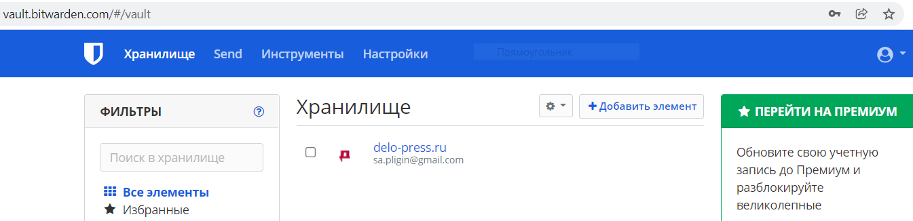
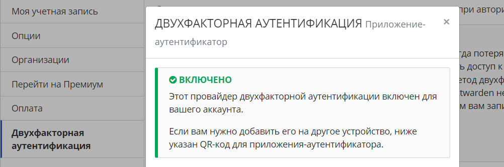
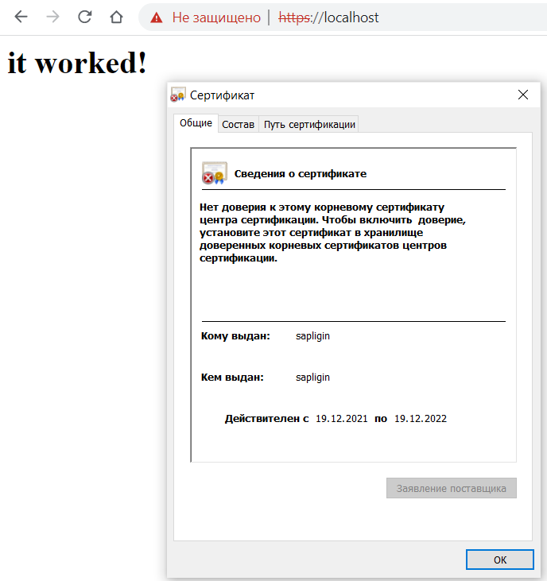

# devops-netology Плигин Сергей
## Домашнее задание к занятию "3.9. Элементы безопасности информационных систем"

#### 1. Установите Bitwarden плагин для браузера. Зарегестрируйтесь и сохраните несколько паролей.
#### Решение:
Плагин установлен, в сервисе зарегистрировался и сохранил пароль.  

#### 2. Установите Google authenticator на мобильный телефон. Настройте вход в Bitwarden акаунт через Google authenticator OTP.
#### Решение:
Вход в Bitwarden акаунт через Google authenticator OTP настроен.  
 
#### 3. Установите apache2, сгенерируйте самоподписанный сертификат, настройте тестовый сайт для работы по HTTPS.
#### Решение:
Apache2 установлен, сертификат сгенерирован, тестовый сайт создан и открывается в хостовой машине.  

#### 4. Проверьте на TLS уязвимости произвольный сайт в интернете (кроме сайтов МВД, ФСБ, МинОбр, НацБанк, РосКосмос, РосАтом, РосНАНО и любых госкомпаний, объектов КИИ, ВПК ... и тому подобное).
#### Решение:

    vagrant@vagrant:~/testssl.sh$ ./testssl.sh -U --sneaky https://github.com
 
    ###########################################################
     testssl.sh       3.1dev from https://testssl.sh/dev/
     (2201a28 2021-12-13 18:24:34 -- )
 
       This program is free software. Distribution and
              modification under GPLv2 permitted.
       USAGE w/o ANY WARRANTY. USE IT AT YOUR OWN RISK!
 
        Please file bugs @ https://testssl.sh/bugs/
 
    ###########################################################

    Using "OpenSSL 1.0.2-chacha (1.0.2k-dev)" [~183 ciphers]
    on vagrant:./bin/openssl.Linux.x86_64
    (built: "Jan 18 17:12:17 2019", platform: "linux-x86_64")
 
 
     Start 2021-12-19 14:26:05        -->> 140.82.121.4:443 (github.com) <<--
    
     rDNS (140.82.121.4):    lb-140-82-121-4-fra.github.com.
    Service detected:       HTTP
   
   
    Testing vulnerabilities
   
    Heartbleed (CVE-2014-0160)                not vulnerable (OK), no heartbeat extension
    CCS (CVE-2014-0224)                       not vulnerable (OK)
    Ticketbleed (CVE-2016-9244), experiment.  not vulnerable (OK), no session ticket extension
    ROBOT                                     not vulnerable (OK)
    Secure Renegotiation (RFC 5746)           supported (OK)
    Secure Client-Initiated Renegotiation     not vulnerable (OK)
    CRIME, TLS (CVE-2012-4929)                not vulnerable (OK)
    BREACH (CVE-2013-3587)                    potentially NOT ok, "gzip" HTTP compression detected. - only supplied "/" tested
                                              Can be ignored for static pages or if no secrets in the page
    POODLE, SSL (CVE-2014-3566)               not vulnerable (OK)
    TLS_FALLBACK_SCSV (RFC 7507)              No fallback possible (OK), no protocol below TLS 1.2 offered
    SWEET32 (CVE-2016-2183, CVE-2016-6329)    not vulnerable (OK)
    FREAK (CVE-2015-0204)                     not vulnerable (OK)
    DROWN (CVE-2016-0800, CVE-2016-0703)      not vulnerable on this host and port (OK)
                                              make sure you don't use this certificate elsewhere with SSLv2 enabled services
                                              https://censys.io/ipv4?q=B6B9A6AF3E866CBE0E6A307E7DDA173B372B2D3AC3F06AF15F97718773848008 could help you to find out
    LOGJAM (CVE-2015-4000), experimental      not vulnerable (OK): no DH EXPORT ciphers, no DH key detected with <= TLS 1.2
    BEAST (CVE-2011-3389)                     not vulnerable (OK), no SSL3 or TLS1
    LUCKY13 (CVE-2013-0169), experimental     potentially VULNERABLE, uses cipher block chaining (CBC) ciphers with TLS. Check patches
    Winshock (CVE-2014-6321), experimental    not vulnerable (OK)
    RC4 (CVE-2013-2566, CVE-2015-2808)        no RC4 ciphers detected (OK)
   
   
    Done 2021-12-19 14:26:44 [  43s] -->> 140.82.121.4:443 (github.com) <<--
#### 5. Установите на Ubuntu ssh сервер, сгенерируйте новый приватный ключ. Скопируйте свой публичный ключ на другой сервер. Подключитесь к серверу по SSH-ключу.
#### Решение:
