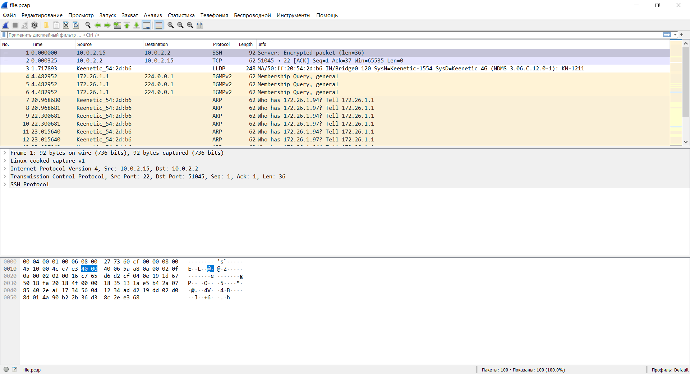

# devops-netology Плигин Сергей
## Домашнее задание к занятию "3.9. Элементы безопасности информационных систем"

#### 1. Установите Bitwarden плагин для браузера. Зарегестрируйтесь и сохраните несколько паролей.
#### Решение:
Плагин установлен, в сервисе зарегистрировался и сохранил пароль.  

#### 2. Установите Google authenticator на мобильный телефон. Настройте вход в Bitwarden акаунт через Google authenticator OTP.
#### Решение:
Вход в Bitwarden акаунт через Google authenticator OTP настроен.  
 
#### 3. Установите apache2, сгенерируйте самоподписанный сертификат, настройте тестовый сайт для работы по HTTPS.
#### Решение:
Apache2 установлен, сертификат сгенерирован, тестовый сайт создан и открывается в хостовой машине.  

#### 4. Проверьте на TLS уязвимости произвольный сайт в интернете (кроме сайтов МВД, ФСБ, МинОбр, НацБанк, РосКосмос, РосАтом, РосНАНО и любых госкомпаний, объектов КИИ, ВПК ... и тому подобное).
#### Решение:

    vagrant@vagrant:~/testssl.sh$ ./testssl.sh -U --sneaky https://github.com
 
    ###########################################################
     testssl.sh       3.1dev from https://testssl.sh/dev/
     (2201a28 2021-12-13 18:24:34 -- )
 
       This program is free software. Distribution and
              modification under GPLv2 permitted.
       USAGE w/o ANY WARRANTY. USE IT AT YOUR OWN RISK!
 
        Please file bugs @ https://testssl.sh/bugs/
 
    ###########################################################

    Using "OpenSSL 1.0.2-chacha (1.0.2k-dev)" [~183 ciphers]
    on vagrant:./bin/openssl.Linux.x86_64
    (built: "Jan 18 17:12:17 2019", platform: "linux-x86_64")
 
 
     Start 2021-12-19 14:26:05        -->> 140.82.121.4:443 (github.com) <<--
    
     rDNS (140.82.121.4):    lb-140-82-121-4-fra.github.com.
    Service detected:       HTTP
   
   
    Testing vulnerabilities
   
    Heartbleed (CVE-2014-0160)                not vulnerable (OK), no heartbeat extension
    CCS (CVE-2014-0224)                       not vulnerable (OK)
    Ticketbleed (CVE-2016-9244), experiment.  not vulnerable (OK), no session ticket extension
    ROBOT                                     not vulnerable (OK)
    Secure Renegotiation (RFC 5746)           supported (OK)
    Secure Client-Initiated Renegotiation     not vulnerable (OK)
    CRIME, TLS (CVE-2012-4929)                not vulnerable (OK)
    BREACH (CVE-2013-3587)                    potentially NOT ok, "gzip" HTTP compression detected. - only supplied "/" tested
                                              Can be ignored for static pages or if no secrets in the page
    POODLE, SSL (CVE-2014-3566)               not vulnerable (OK)
    TLS_FALLBACK_SCSV (RFC 7507)              No fallback possible (OK), no protocol below TLS 1.2 offered
    SWEET32 (CVE-2016-2183, CVE-2016-6329)    not vulnerable (OK)
    FREAK (CVE-2015-0204)                     not vulnerable (OK)
    DROWN (CVE-2016-0800, CVE-2016-0703)      not vulnerable on this host and port (OK)
                                              make sure you don't use this certificate elsewhere with SSLv2 enabled services
                                              https://censys.io/ipv4?q=B6B9A6AF3E866CBE0E6A307E7DDA173B372B2D3AC3F06AF15F97718773848008 could help you to find out
    LOGJAM (CVE-2015-4000), experimental      not vulnerable (OK): no DH EXPORT ciphers, no DH key detected with <= TLS 1.2
    BEAST (CVE-2011-3389)                     not vulnerable (OK), no SSL3 or TLS1
    LUCKY13 (CVE-2013-0169), experimental     potentially VULNERABLE, uses cipher block chaining (CBC) ciphers with TLS. Check patches
    Winshock (CVE-2014-6321), experimental    not vulnerable (OK)
    RC4 (CVE-2013-2566, CVE-2015-2808)        no RC4 ciphers detected (OK)
   
   
    Done 2021-12-19 14:26:44 [  43s] -->> 140.82.121.4:443 (github.com) <<--
#### 5. Установите на Ubuntu ssh сервер, сгенерируйте новый приватный ключ. Скопируйте свой публичный ключ на другой сервер. Подключитесь к серверу по SSH-ключу.
#### Решение:
Установил ssh сервер командами 

    apt install openssh-server
    systemctl start sshd.service
    systemctl enable ssh.service
Сгенерировал приватный ключ командой `ssh-keygen`.  
Поднял еще одну виртуальную машину с Ubuntu и настроил сетевые интерфейсы двух машин в одну подсеть `172.26.1.0/24`.  
Успешно скопировал ssh ключ на вторую ВМ. При копировании ключа запрашивался пароль для подлючения к ВМ  

    vagrant@vagrant:~$ ssh-copy-id vagrant@172.26.1.3
    /usr/bin/ssh-copy-id: INFO: Source of key(s) to be installed: "/home/vagrant/.ssh/id_rsa.pub"
    The authenticity of host '172.26.1.3 (172.26.1.3)' can't be established.
    ECDSA key fingerprint is SHA256:wSHl+h4vAtTT7mbkj2lbGyxWXWTUf6VUliwpncjwLPM.
    Are you sure you want to continue connecting (yes/no/[fingerprint])? yes
    /usr/bin/ssh-copy-id: INFO: attempting to log in with the new key(s), to filter out any that are already installed
    /usr/bin/ssh-copy-id: INFO: 1 key(s) remain to be installed -- if you are prompted now it is to install the new keys
    vagrant@172.26.1.3's password:
    
    Number of key(s) added: 1
    
    Now try logging into the machine, with:   "ssh 'vagrant@172.26.1.3'"
    and check to make sure that only the key(s) you wanted were added.

При подключении к ВМ по ssh ключу пароль не запрашивается и авторизация происходит автоматически  

    vagrant@vagrant:~$ ssh vagrant@172.26.1.3
    Welcome to Ubuntu 20.04.3 LTS (GNU/Linux 5.4.0-80-generic x86_64)

     * Documentation:  https://help.ubuntu.com
     * Management:     https://landscape.canonical.com
     * Support:        https://ubuntu.com/advantage
    
      System information as of Tue 21 Dec 2021 10:36:29 AM UTC
    
      System load:  0.0               Processes:             119
      Usage of /:   2.8% of 61.31GB   Users logged in:       1
      Memory usage: 24%               IPv4 address for eth0: 10.0.2.15
      Swap usage:   0%                IPv4 address for eth1: 172.26.1.3
    
    
    This system is built by the Bento project by Chef Software
    More information can be found at https://github.com/chef/bento
    Last login: Tue Dec 21 10:04:02 2021 from 10.0.2.2
#### 6. Переименуйте файлы ключей из задания 5. Настройте файл конфигурации SSH клиента, так чтобы вход на удаленный сервер осуществлялся по имени сервера.
#### Решение:
Файлы ssh ключа переименованы. Создан ssh config файл:  

    vagrant@vagrant:~$ cat .ssh/config
    Host remote_server
    HostName 172.26.1.3
    IdentityFile ~/.ssh/pligin_rsa
    User vagrant

Так как настроенного DNS сервера в сети нет, то чтобы сопоставить имя ВМ по ее IP адресу, нужно внести соответствующуу запись в `/etc/hosts/`  

    vagrant@vagrant:~$ sudo cat /etc/hosts
    127.0.0.1       localhost
    127.0.1.1       vagrant.vm      vagrant
    172.26.1.3      remote_server
В результате удалось зайти на удаленную ВМ по имени:  

    vagrant@vagrant:~$ ssh remote_server
    Welcome to Ubuntu 20.04.3 LTS (GNU/Linux 5.4.0-80-generic x86_64)

     * Documentation:  https://help.ubuntu.com
     * Management:     https://landscape.canonical.com
     * Support:        https://ubuntu.com/advantage

    System information as of Tue 21 Dec 2021 12:49:27 PM UTC

    System load:  0.0               Processes:             114
    Usage of /:   2.8% of 61.31GB   Users logged in:       1
    Memory usage: 19%               IPv4 address for eth0: 10.0.2.15
    Swap usage:   0%                IPv4 address for eth1: 172.26.1.3

    This system is built by the Bento project by Chef Software
    More information can be found at https://github.com/chef/bento
    Last login: Tue Dec 21 10:36:30 2021 from 172.26.1.4
#### 7. Соберите дамп трафика утилитой tcpdump в формате pcap, 100 пакетов. Откройте файл pcap в Wireshark.
#### Решение:
Устанавливаем tcpdump командой `apt install tcpdump`  
Командой `tcpdump -i any -c 100 -w file.pcap` собираем дамп, где `-i any` - все доступные сетевые интерфейсы, `-c 100` - количество пакетов, `-r file.pcap` - захват пакетов в pcap файл  

      vagrant@vagrant:~$ sudo tcpdump -i any -c 100 -w file.pcap
      tcpdump: listening on any, link-type LINUX_SLL (Linux cooked v1), capture size 262144 bytes
      100 packets captured
      107 packets received by filter
      0 packets dropped by kernel
С помощью программы WinSCP копирую файл в хост с Windows и открываю файл в Wireshark  
 