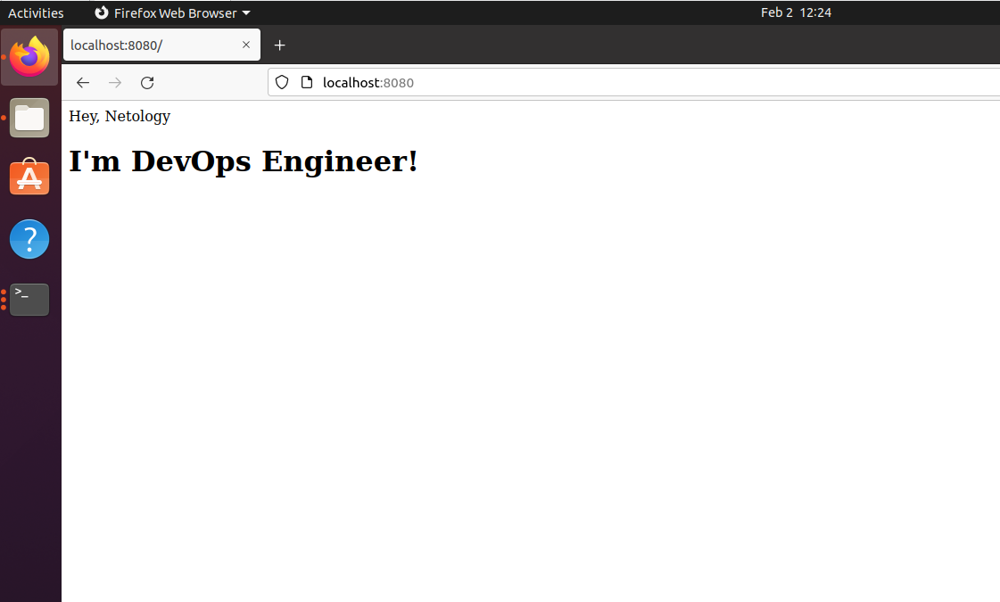

# Домашнее задание к занятию "5.3. Введение. Экосистема. Архитектура. Жизненный цикл Docker контейнера"
## Задача 1
- создайте свой репозиторий на https://hub.docker.com;  
- выберете любой образ, который содержит веб-сервер Nginx;  
- создайте свой fork образа;  
- реализуйте функциональность: запуск веб-сервера в фоне с индекс-страницей, содержащей HTML-код ниже:

```
<html>
<head>
Hey, Netology
</head>
<body>
<h1>I’m DevOps Engineer!</h1>
</body>
</html>
```
Опубликуйте созданный форк в своем репозитории и предоставьте ответ в виде ссылки.
## Решение:
### Ссылка на свой репозиторий с образом: https://hub.docker.com/r/sapligin/nginx  
Установил Docker по инструкции с https://docs.docker.com/.  
Создал свой репозиторий на https://hub.docker.com/.  
Выбрал официальный образ nginx и загрузил образ из Docker реестра командой `docker pull nginx:1.21.6`.  
На хосте создал index.html с необходимым HTML кодом.  
Запустил контейнер nginx `sudo docker run -d -p 8080:80 --name nginx nginx:1.21.6
`  
Командой `sudo docker cp index.html nginx:/usr/share/nginx/html/
` скопировал index.html с необходимым содержимым в контейнер.  
Сделал коммит изменения и сохранил в новый образ sapligin/nginx:v1 `sudo docker container commit nginx sapligin/nginx:v1
`  
Зашел в Docker репозиторий `sudo docker login -u sapligin`  
Закачал свой fork образа `sudo docker push sapligin/nginx:v1`  
Запускаем свой образ командой `sudo docker run -d -p 8080:80 --name mynginx sapligin/nginx:v1`  
В браузере открываем страницу http://localhost:8080/  
 
## Задача 2
Посмотрите на сценарий ниже и ответьте на вопрос: "Подходит ли в этом сценарии использование Docker контейнеров или лучше подойдет виртуальная машина, физическая машина? Может быть возможны разные варианты?"

Детально опишите и обоснуйте свой выбор.

--

Сценарий:

- Высоконагруженное монолитное java веб-приложение;
- Nodejs веб-приложение;
- Мобильное приложение c версиями для Android и iOS;
- Шина данных на базе Apache Kafka;
- Elasticsearch кластер для реализации логирования продуктивного веб-приложения - три ноды elasticsearch, два logstash и две ноды kibana;
- Мониторинг-стек на базе Prometheus и Grafana;
- MongoDB, как основное хранилище данных для java-приложения;
- Gitlab сервер для реализации CI/CD процессов и приватный (закрытый) Docker Registry.
## Решение:
- Для высоконагруженного монолитного java веб-приложения подойдет либо физический сервер, либо виртуальная машина.  
Docker для такого решения не подойдет, так как нет возможности разбить приложение на отдельные компоненты. Docker будет использовать столько системных ресурсов, сколько ему позволит планировщик ядра хоста.  
Для Docker контейнеров следует устанавливать лимиты использования памяти, CPU или блока ввода-вывода. В противном случае, если ядро обнаружит, что память машины-хоста слишком загружена для выполнения важных системных функций, оно может начать убивать важные процессы, в том числе и Docker.
- Nodejs веб-приложение - Docker контейнер подойдет, так как все зависимости упаковываются и есть возможность масштабировать компоненты приложения в отдельные контейнеры.
- Мобильное приложение c версиями для Android и iOS - подойдет железный сервер, либо виртуальная машина.  
Насколько мне известно, в данный момент есть средства для разработки и тестирования iOS приложений на платформах, отличных от Mac, однако это противоречит лицензии Apple.  
Так же, так как приложения для Android и iOS подразумевают графический интерфейс, то для полноценной их работы Docker контейнер не подойдет.
- Шина данных на базе Apache Kafka - при условии, что данные Kafka хранятся в примонтированных томах, то можно использовать Docker.  
- Elasticsearch кластер для реализации логирования продуктивного веб-приложения - по официальной документации все можно использовать в Docker контейнерах.
- Мониторинг-стек на базе Prometheus и Grafana - если нод для мониторинга не много, то можно использовать Docker. В ином случае лучше, наверное, использовать для Prometheus физический сервер, либо ВМ.
- MongoDB, как основное хранилище данных для java-приложения - мне кажется, что не стоит хранить любую базу данных внутри Docker контейнера, так как все добавленные в базу во время работы приложения данные пропадут после перезапуска контейнера. Так что Docker не подходит.
- Gitlab сервер для реализации CI/CD процессов и приватный (закрытый) Docker Registry - судя по официальной документации Gitlab вполне можно использовать Docker контейнеры.
## Задача 3
- Запустите первый контейнер из образа _**centos**_ c любым тэгом в фоновом режиме, подключив папку `/data` из текущей рабочей директории на хостовой машине в `/data` контейнера;
- Запустите второй контейнер из образа **_debian_** в фоновом режиме, подключив папку `/data` из текущей рабочей директории на хостовой машине в `/data` контейнера;
- Подключитесь к первому контейнеру с помощью `docker exec` и создайте текстовый файл любого содержания в `/data`;
- Добавьте еще один файл в папку `/data` на хостовой машине;
- Подключитесь во второй контейнер и отобразите листинг и содержание файлов в `/data` контейнера.
## Решение:
Запускать контейнеры нужно с ключом `--tty`.  
Команда запуска **_centos_** `sudo docker run -d -tty -v /home/pligin/data:/home/data/ centos:latest`  
Команда запуска **_debian_** `sudo docker run -d -tty -v /home/pligin/data:/home/data/ debian:latest`  
Запущенные контейнеры:
```
pligin@ubuntu:~/Desktop$ sudo docker container ls
CONTAINER ID   IMAGE           COMMAND       CREATED              STATUS              PORTS     NAMES
b84d1d9c7125   debian:latest   "bash"        About a minute ago   Up About a minute             quirky_hermann
878f3170f63b   centos:latest   "/bin/bash"   About a minute ago   Up About a minute             agitated_sutherland
```
Создал файл в centos в папке /data
```
[root@878f3170f63b data]# echo "from centos" >> /home/data/test1.txt
```
Листинг файлов с контейнера debian:
```
oot@b84d1d9c7125:/home/data# ls -l
total 0
-rw-r--r-- 1 root root 0 Feb  2 10:17 test1.txt
-rw-rw-r-- 1 1000 1000 0 Feb  2 10:17 test2.txt
root@b84d1d9c7125:/home/data# cat test1.txt 
from centos
root@b84d1d9c7125:/home/data# cat test2.txt 
from host
```
##Задача 4*
Воспроизвести практическую часть лекции самостоятельно.  

Соберите Docker образ с Ansible, загрузите на Docker Hub и пришлите ссылку вместе с остальными ответами к задачам.
## Решение:
Ссылка на репозиторий с **_ansible_**: https://hub.docker.com/r/sapligin/ansible