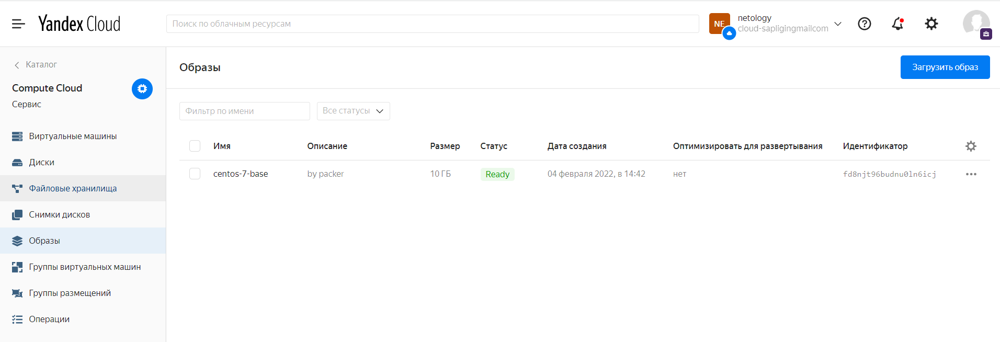
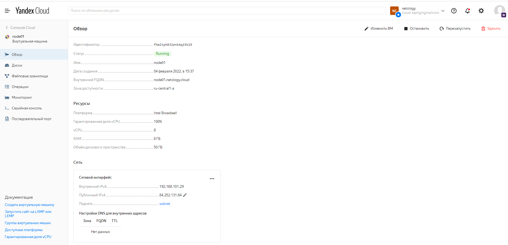
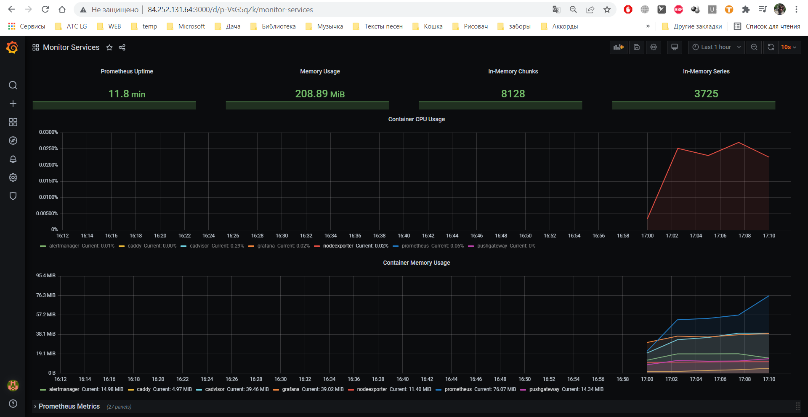

# Домашнее задание к занятию "5.4. Оркестрация группой Docker контейнеров на примере Docker Compose"
## Задача 1
Создать собственный образ операционной системы с помощью Packer.

Для получения зачета, вам необходимо предоставить:

- Скриншот страницы, как на слайде из презентации (слайд 37).
## Решение:
Образ операционной системы с помощью Packer создан: 
```
pligin@ubuntu:~/Documents/src/ansible$ yc compute image list
+----------------------+---------------+--------+----------------------+--------+
|          ID          |     NAME      | FAMILY |     PRODUCT IDS      | STATUS |
+----------------------+---------------+--------+----------------------+--------+
| fd8njt96budnu0ln6icj | centos-7-base | centos | f2eacrudv331nbat9ehb | READY  |
+----------------------+---------------+--------+----------------------+--------+
```
 
## Задача 2
Создать вашу первую виртуальную машину в Яндекс.Облаке.

Для получения зачета, вам необходимо предоставить:

- Скриншот страницы свойств созданной ВМ, как на примере
## Решение:
Виртуальная машина в Яндекс.Облаке создана:  
 
## Задача 3
Создать ваш первый готовый к боевой эксплуатации компонент мониторинга, состоящий из стека микросервисов.

Для получения зачета, вам необходимо предоставить:

- Скриншот работающего веб-интерфейса Grafana с текущими метриками, как на примере
## Решение:
Скриншот работающего веб-интерфейса Grafana с текущими метриками:  
 