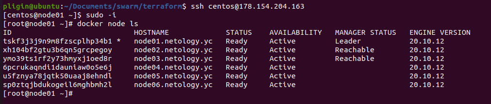
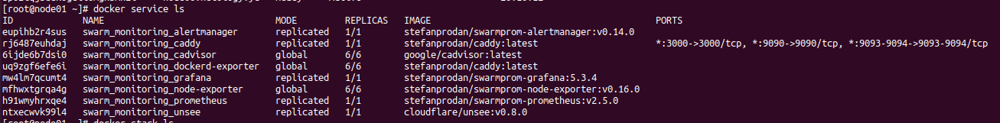

# Домашнее задание к занятию "5.5. Оркестрация кластером Docker контейнеров на примере Docker Swarm"
## Задача 1
Дайте письменые ответы на следующие вопросы:

- В чём отличие режимов работы сервисов в Docker Swarm кластере: replication и global?
- Какой алгоритм выбора лидера используется в Docker Swarm кластере?
- Что такое Overlay Network?
## Решение:
- В режиме replication можно ограничить запуск сервиса необходимым количеством его реплик в кластере. В режиме global сервис гарантированно запустится на всех узлах кластера.
- используется Raft - алгоритм выбора нового лидера из управляющих нод, вместо выбышего лидера.
- Overlay Network - это распределенная сеть между несколькими Docker хостами. Эта сеть находится поверх (перекрывает) сети, специфичные для хоста, позволяя контейнерам, подключенным к ней, безопасно обмениваться данными при включенном шифровании.
## Задача 2
Создать ваш первый Docker Swarm кластер в Яндекс.Облаке

Для получения зачета, вам необходимо предоставить скриншот из терминала (консоли), с выводом команды:

```
docker node ls
```
## Решение:
 
## Задача 3
Создать ваш первый, готовый к боевой эксплуатации кластер мониторинга, состоящий из стека микросервисов.

Для получения зачета, вам необходимо предоставить скриншот из терминала (консоли), с выводом команды:

```
docker service ls
```
## Решение:
 
## Задача 4 (*)
Выполнить на лидере Docker Swarm кластера команду (указанную ниже) и дать письменное описание её функционала, что она делает и зачем она нужна:

```
# см.документацию: https://docs.docker.com/engine/swarm/swarm_manager_locking/
docker swarm update --autolock=true
```
## Решение:
После ввода данной команды и перезагрузки сервиса docker на ноде swarm заблокировался.  
Журналы Raft, используемые менеджерами swarm, по умолчанию зашифрованы. Это шифрование в состоянии покоя защищает конфигурацию и данные сервисов от злоумышленников, которые могут получить доступ к зашифрованным журналам Raft.  
При перезапуске Docker в память каждого узла менеджера загружаются как ключ TLS, используемый для шифрования связи между узлами swarm, так и ключ, используемый для шифрования и расшифровки журналов Raft.  
Функция `autolock ` защищает общий ключ шифрования TLS и ключ, используемый для шифрования и расшифровки журналов Raft и требует разблокировки менеджера.  
Когда docker перезапустится, нужно сначала разблокировать swarm, используя ключ шифрования, сгенерированный docker, когда swarm был заблокирован.  
Разблокируется swarm командой `docker swarm unlock` и вводом ключа шифрования.