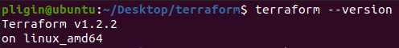
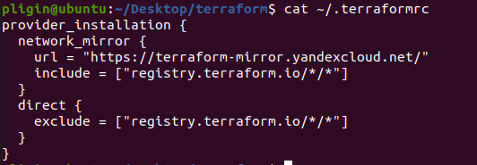
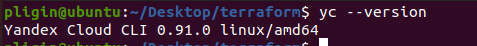
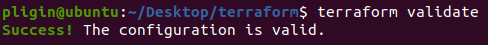
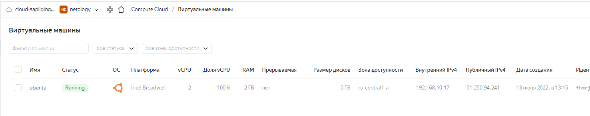

# Домашнее задание к занятию "7.2. Облачные провайдеры и синтаксис Terraform."
## Задача 1 (Вариант с Yandex.Cloud). Регистрация в ЯО и знакомство с основами.
1. Подробная инструкция на русском языке содержится [здесь](https://cloud.yandex.ru/docs/solutions/infrastructure-management/terraform-quickstart).
2. Обратите внимание на период бесплатного использования после регистрации аккаунта.
3. Используйте раздел "Подготовьте облако к работе" для регистрации аккаунта. Далее раздел "Настройте провайдер" для подготовки базового терраформ конфига.
4. Воспользуйтесь [инструкцией](https://registry.terraform.io/providers/yandex-cloud/yandex/latest/docs) на сайте терраформа, что бы не указывать авторизационный токен в коде, а терраформ провайдер брал его из переменных окружений.

## Решение:
Зарегистрировался в Yandex.Cloud.  
Подготовил облако к работе и настроил провайдер:  
Версия terraform  
  
Настройка провайдера  
  
Устанавливаем `Yandex CLI`  


## Задача 2. Создание yandex_compute_instance через терраформ.
1. В каталоге `terraform` вашего основного репозитория, который был создан в начале курсе, создайте файл `main.tf` и `versions.tf`.
2. Зарегистрируйте провайдер
   1. для [yandex.cloud](https://registry.terraform.io/providers/yandex-cloud/yandex/latest/docs). Подробную инструкцию можно найти [здесь](https://cloud.yandex.ru/docs/solutions/infrastructure-management/terraform-quickstart).
3. Внимание! В гит репозиторий нельзя пушить ваши личные ключи доступа к аккаунту. Поэтому в предыдущем задании мы указывали их в виде переменных окружения.
4. В файле `main.tf` воспользуйтесь блоком `data "aws_ami` для поиска ami образа последнего Ubuntu.
5. В файле `main.tf` создайте ресурс
   1. [yandex_compute_image](https://registry.terraform.io/providers/yandex-cloud/yandex/latest/docs/resources/compute_image).
6. Если вы выполнили первый пункт, то добейтесь того, что бы команда terraform plan выполнялась без ошибок.
   
В качестве результата задания предоставьте:

1. Ответ на вопрос: при помощи какого инструмента (из разобранных на прошлом занятии) можно создать свой образ ami?
2. Ссылку на репозиторий с исходной конфигурацией терраформа.

## Решение:
Настройка провайдера  
  
Ключ доступа к аккаунту указан в виде переменной `YC_TOKEN`.  
В файле `main.tf` описан блок с виртуальной машиной и сетью. Код файла `main.tf`:  
```terraform
terraform {
  required_providers {
    yandex = {
      source = "yandex-cloud/yandex"
    }
  }
  required_version = ">= 0.13"
}

provider "yandex" {
  token     = var.YC_TOKEN
  cloud_id  = "b1gkps1kvm3lbn7tuqda"
  folder_id = "b1g17mdarsc1bia6qhjt"
  zone      = "ru-central1-a"
}

resource "yandex_compute_instance" "vm" {
  name = "ubuntu"

  resources {
    cores  = 2
    memory = 2
  }

  boot_disk {
    initialize_params {
      image_id = "fd87tirk5i8vitv9uuo1"
    }
  }

  network_interface {
    subnet_id = yandex_vpc_subnet.subnet-1.id
    nat       = true
  }

  metadata = {
    ssh-keys = "ubuntu:${file("~/.ssh/id_rsa.pub")}"
  }
}

resource "yandex_vpc_network" "network-1" {
  name = "network1"
}

resource "yandex_vpc_subnet" "subnet-1" {
  name           = "subnet1"
  zone           = "ru-central1-a"
  network_id     = yandex_vpc_network.network-1.id
  v4_cidr_blocks = ["192.168.10.0/24"]
}

output "internal_ip_address_vm" {
  value = yandex_compute_instance.vm.network_interface.0.ip_address
}

output "external_ip_address_vm" {
  value = yandex_compute_instance.vm.network_interface.0.nat_ip_address
}
```
Проверяем конфигурацию командой `terraform validate`  
  

После проверки конфигурации выполняем команду `terraform plan`:  
```terraform
Terraform used the selected providers to generate the following execution plan. Resource actions are indicated with the following symbols:
  + create

Terraform will perform the following actions:

  # yandex_compute_instance.vm will be created
  + resource "yandex_compute_instance" "vm" {
      + created_at                = (known after apply)
      + folder_id                 = (known after apply)
      + fqdn                      = (known after apply)
      + hostname                  = (known after apply)
      + id                        = (known after apply)
      + metadata                  = {
          + "ssh-keys" = <<-EOT
                ubuntu:ssh-rsa AAAAB3NzaC1yc2EAAAADAQABAAABAQCvRP2mVTWWAzPadjrCbc8bTExjlgA1/XwJKqtyjRHDiMFLjGtfjDuZM7qPAripk4IBHYsQQ7/96P3ZzUDarQpf7O7Qn4ZRlKX2yMWPUpzeBcoemDD/oIBlkCTS2zb0Xq4StHbpB0e0Th+AjB+pjHIpFtm9Fg7disj29UvOLYsFcjOE3Ui1EG/dAxVDJK2YWCJHONgXczMgOy2O4mK9OWbTy/KtSTjCMFWiwTEF2rotzIPsh7LKqpZ2Vubtt6vpu9SbeREdevArb pligin@ubuntu
            EOT
        }
      + name                      = "ubuntu"
      + network_acceleration_type = "standard"
      + platform_id               = "standard-v1"
      + service_account_id        = (known after apply)
      + status                    = (known after apply)
      + zone                      = (known after apply)

      + boot_disk {
          + auto_delete = true
          + device_name = (known after apply)
          + disk_id     = (known after apply)
          + mode        = (known after apply)

          + initialize_params {
              + block_size  = (known after apply)
              + description = (known after apply)
              + image_id    = "fd87tirk5i8vitv9uuo1"
              + name        = (known after apply)
              + size        = (known after apply)
              + snapshot_id = (known after apply)
              + type        = "network-hdd"
            }
        }

      + network_interface {
          + index              = (known after apply)
          + ip_address         = (known after apply)
          + ipv4               = true
          + ipv6               = (known after apply)
          + ipv6_address       = (known after apply)
          + mac_address        = (known after apply)
          + nat                = true
          + nat_ip_address     = (known after apply)
          + nat_ip_version     = (known after apply)
          + security_group_ids = (known after apply)
          + subnet_id          = (known after apply)
        }

      + placement_policy {
          + host_affinity_rules = (known after apply)
          + placement_group_id  = (known after apply)
        }

      + resources {
          + core_fraction = 100
          + cores         = 2
          + memory        = 2
        }

      + scheduling_policy {
          + preemptible = (known after apply)
        }
    }

  # yandex_vpc_network.network-1 will be created
  + resource "yandex_vpc_network" "network-1" {
      + created_at                = (known after apply)
      + default_security_group_id = (known after apply)
      + folder_id                 = (known after apply)
      + id                        = (known after apply)
      + labels                    = (known after apply)
      + name                      = "network1"
      + subnet_ids                = (known after apply)
    }

  # yandex_vpc_subnet.subnet-1 will be created
  + resource "yandex_vpc_subnet" "subnet-1" {
      + created_at     = (known after apply)
      + folder_id      = (known after apply)
      + id             = (known after apply)
      + labels         = (known after apply)
      + name           = "subnet1"
      + network_id     = (known after apply)
      + v4_cidr_blocks = [
          + "192.168.10.0/24",
        ]
      + v6_cidr_blocks = (known after apply)
      + zone           = "ru-central1-a"
    }

Plan: 3 to add, 0 to change, 0 to destroy.

Changes to Outputs:
  + external_ip_address_vm = (known after apply)
  + internal_ip_address_vm = (known after apply)

────────────────────────────────────────────────────────────────────────────────────────────────────────────────────────────────────────────────────────────────────────────────────

Note: You didn't use the -out option to save this plan, so Terraform can't guarantee to take exactly these actions if you run "terraform apply" now.
```
Чтобы создать ресурсы выполняем команду `terraform apply`.  
Виртуальная машина создана в облаке:  
  

Так как это домашнее задание выполняется в Yandex.Cloud, и на прошлых занятиях тоже использовали его же, свой образ ОС создавали при помощи `Packer`.

[Ссылка на репозиторий с конфигурацией terraform](terraform).