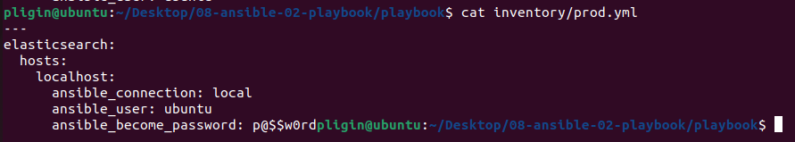
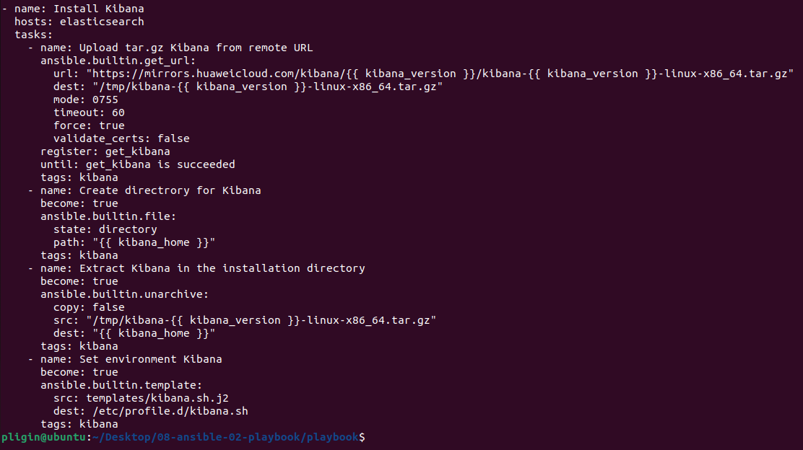
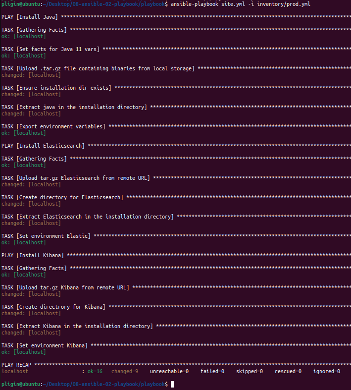
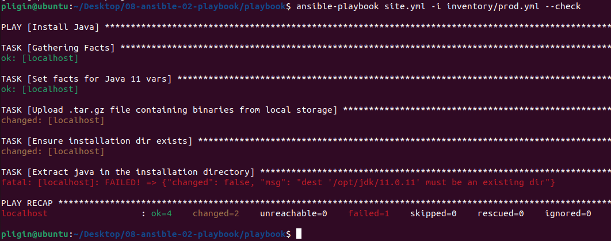

# Домашнее задание к занятию "08.02 Работа с Playbook"

## Подготовка к выполнению
1. Создайте свой собственный (или используйте старый) публичный репозиторий на github с произвольным именем.
2. Скачайте [playbook](./playbook/) из репозитория с домашним заданием и перенесите его в свой репозиторий.
3. Подготовьте хосты в соотвтествии с группами из предподготовленного playbook. 
4. Скачайте дистрибутив [java](https://www.oracle.com/java/technologies/javase-jdk11-downloads.html) и положите его в директорию `playbook/files/`. 

## Основная часть
1. Приготовьте свой собственный inventory файл `prod.yml`.
## Решение:
Подготовлен собственный файл `prod.yml`



2. Допишите playbook: нужно сделать ещё один play, который устанавливает и настраивает kibana.
## Решение:
Дописан playbook, сделан play, который устанавливает kibana


3. При создании tasks рекомендую использовать модули: `get_url`, `template`, `unarchive`, `file`.
4. Tasks должны: скачать нужной версии дистрибутив, выполнить распаковку в выбранную директорию, сгенерировать конфигурацию с параметрами.
## Решение:
Так как из России нет доступа к скачиванию дистрибутивов elastic и kibana, то использовал ссылки на дистрибутивы на ресурсе `https://mirrors.huaweicloud.com/`

Процесс выполнения playbook:




5. Запустите `ansible-lint site.yml` и исправьте ошибки, если они есть.
6. Попробуйте запустить playbook на этом окружении с флагом `--check`.
## Решение:
Запуск playbook на этом окружении с флагом `--check`



7. Запустите playbook на `prod.yml` окружении с флагом `--diff`. Убедитесь, что изменения на системе произведены.
## Решение:
Запуск playbook на `prod.yml` окружении с флагом `--diff`
```commandline
pligin@ubuntu:~/Desktop/08-ansible-02-playbook/playbook$ ansible-playbook site.yml -i inventory/prod.yml --diff

PLAY [Install Java] ***************************************************************************************************************************************************************************************

TASK [Gathering Facts] ************************************************************************************************************************************************************************************
ok: [localhost]

TASK [Set facts for Java 11 vars] *************************************************************************************************************************************************************************
ok: [localhost]

TASK [Upload .tar.gz file containing binaries from local storage] *****************************************************************************************************************************************
ok: [localhost]

TASK [Ensure installation dir exists] *********************************************************************************************************************************************************************
--- before
+++ after
@@ -1,4 +1,4 @@
 {
     "path": "/opt/jdk/11.0.11",
-    "state": "absent"
+    "state": "directory"
 }

changed: [localhost]

TASK [Extract java in the installation directory] *********************************************************************************************************************************************************
changed: [localhost]

TASK [Export environment variables] ***********************************************************************************************************************************************************************
--- before
+++ after: /home/pligin/.ansible/tmp/ansible-local-42205hr4ok3e/tmpo1rqmhde/jdk.sh.j2
@@ -0,0 +1,5 @@
+# Warning: This file is Ansible Managed, manual changes will be overwritten on next playbook run.
+#!/usr/bin/env bash
+
+export JAVA_HOME=/opt/jdk/11.0.11
+export PATH=$PATH:$JAVA_HOME/bin
\ No newline at end of file

changed: [localhost]

PLAY [Install Elasticsearch] ******************************************************************************************************************************************************************************

TASK [Gathering Facts] ************************************************************************************************************************************************************************************
ok: [localhost]

TASK [Upload tar.gz Elasticsearch from remote URL] ********************************************************************************************************************************************************
changed: [localhost]

TASK [Create directory for Elasticsearch] *****************************************************************************************************************************************************************
ok: [localhost]

TASK [Extract Elasticsearch in the installation directory] ************************************************************************************************************************************************
skipping: [localhost]

TASK [Set environment Elastic] ****************************************************************************************************************************************************************************
--- before
+++ after: /home/pligin/.ansible/tmp/ansible-local-42205hr4ok3e/tmp133ibkb3/elk.sh.j2
@@ -0,0 +1,5 @@
+# Warning: This file is Ansible Managed, manual changes will be overwritten on next playbook run.
+#!/usr/bin/env bash
+
+export ES_HOME=/opt/elastic/7.10.1
+export PATH=$PATH:$ES_HOME/bin
\ No newline at end of file

changed: [localhost]

PLAY [Install Kibana] *************************************************************************************************************************************************************************************

TASK [Gathering Facts] ************************************************************************************************************************************************************************************
ok: [localhost]

TASK [Upload tar.gz Kibana from remote URL] ***************************************************************************************************************************************************************
changed: [localhost]

TASK [Create directrory for Kibana] ***********************************************************************************************************************************************************************
--- before
+++ after
@@ -1,4 +1,4 @@
 {
     "path": "/opt/kibana/7.10.1/kibana-7.10.1-linux-x86_64",
-    "state": "absent"
+    "state": "directory"
 }

changed: [localhost]

TASK [Extract Kibana in the installation directory] *******************************************************************************************************************************************************
changed: [localhost]

TASK [Set environment Kibana] *****************************************************************************************************************************************************************************
--- before
+++ after: /home/pligin/.ansible/tmp/ansible-local-42205hr4ok3e/tmpxnr9xlv9/kibana.sh.j2
@@ -0,0 +1,5 @@
+# Warning: This file is Ansible Managed, manual changes will be overwritten on next playbook run.
+#!/usr/bin/env bash
+
+export KIBANA_HOME=/opt/kibana/7.10.1/kibana-7.10.1-linux-x86_64
+export PATH=$PATH:$KIBANA_HOME/bin
\ No newline at end of file

changed: [localhost]

PLAY RECAP ************************************************************************************************************************************************************************************************
localhost                  : ok=15   changed=9    unreachable=0    failed=0    skipped=1    rescued=0    ignored=0   

```

8. Повторно запустите playbook с флагом `--diff` и убедитесь, что playbook идемпотентен.
## Решение:
Повторный запуск playbook с флагом `--diff`
```commandline
pligin@ubuntu:~/Desktop/08-ansible-02-playbook/playbook$ ansible-playbook site.yml -i inventory/prod.yml --diff

PLAY [Install Java] ***************************************************************************************************************************************************************************************

TASK [Gathering Facts] ************************************************************************************************************************************************************************************
ok: [localhost]

TASK [Set facts for Java 11 vars] *************************************************************************************************************************************************************************
ok: [localhost]

TASK [Upload .tar.gz file containing binaries from local storage] *****************************************************************************************************************************************
ok: [localhost]

TASK [Ensure installation dir exists] *********************************************************************************************************************************************************************
ok: [localhost]

TASK [Extract java in the installation directory] *********************************************************************************************************************************************************
skipping: [localhost]

TASK [Export environment variables] ***********************************************************************************************************************************************************************
ok: [localhost]

PLAY [Install Elasticsearch] ******************************************************************************************************************************************************************************

TASK [Gathering Facts] ************************************************************************************************************************************************************************************
ok: [localhost]

TASK [Upload tar.gz Elasticsearch from remote URL] ********************************************************************************************************************************************************
ok: [localhost]

TASK [Create directory for Elasticsearch] *****************************************************************************************************************************************************************
ok: [localhost]

TASK [Extract Elasticsearch in the installation directory] ************************************************************************************************************************************************
skipping: [localhost]

TASK [Set environment Elastic] ****************************************************************************************************************************************************************************
ok: [localhost]

PLAY [Install Kibana] *************************************************************************************************************************************************************************************

TASK [Gathering Facts] ************************************************************************************************************************************************************************************
ok: [localhost]

TASK [Upload tar.gz Kibana from remote URL] ***************************************************************************************************************************************************************
ok: [localhost]

TASK [Create directrory for Kibana] ***********************************************************************************************************************************************************************
ok: [localhost]

TASK [Extract Kibana in the installation directory] *******************************************************************************************************************************************************
ok: [localhost]

TASK [Set environment Kibana] *****************************************************************************************************************************************************************************
ok: [localhost]

PLAY RECAP ************************************************************************************************************************************************************************************************
localhost                  : ok=14   changed=0    unreachable=0    failed=0    skipped=2    rescued=0    ignored=0
```

9. Подготовьте README.md файл по своему playbook. В нём должно быть описано: что делает playbook, какие у него есть параметры и теги.
10. Готовый playbook выложите в свой репозиторий, в ответ предоставьте ссылку на него.
## Решение:
[Ссылка на репозиторий с playbook](https://github.com/sapligin/08-ansible-02-playbook/blob/main/README.md)
