# Домашнее задание к занятию "09.03 Jenkins"

## Подготовка к выполнению

1. Установить jenkins по любой из [инструкций](https://www.jenkins.io/download/)
2. Запустить и проверить работоспособность
3. Сделать первоначальную настройку
4. Настроить под свои нужды
5. Поднять отдельный cloud
6. Для динамических агентов можно использовать [образ](https://hub.docker.com/repository/docker/aragast/agent)
7. Обязательный параметр: поставить label для динамических агентов: `ansible_docker`
8. Сделать форк репозитория с [playbook](https://github.com/aragastmatb/example-playbook)

## Решение
Jenkins установлен, установлены стандартные плагины, проведена первоначальная настройка, добавлен пользователь `pligin` с административными правами, дополнительно установлен плагин `Docker` для последующей работы с динамическим агентом.

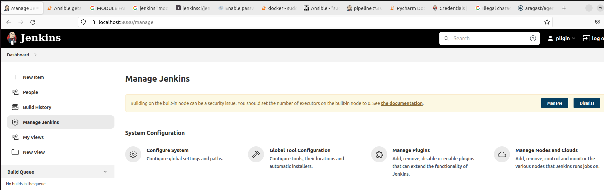

Поднят отдельный cloud, для динамических агентов используется образ `aragast/agent`, агент Jenkins установлен на одном хосте с мастером Jenkins, установлен label для динамических агентов `ansible_docker`
Так как агент Jenkins установлен на одном хосте с мастером Jenkins, даны необходимые разрешения для `/var/run/docker.sock` 
```
sudo chmod a+rwx /var/run/docker.sock
sudo chmod a+rwx /var/run/docker.pid
```
иначе тест и сохранение настроек приводят к ошибке `Unix / TCP socket (with unix:///var/run/docker.sock): Permission Denied`

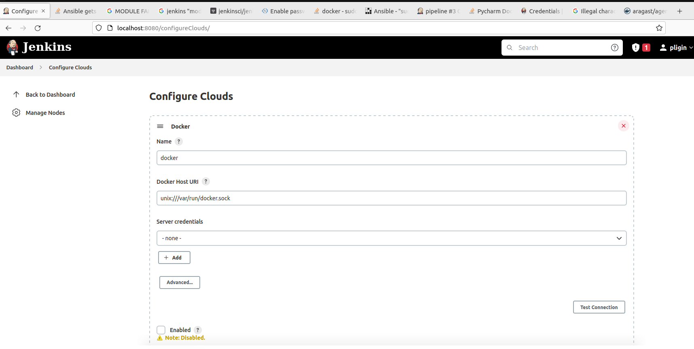

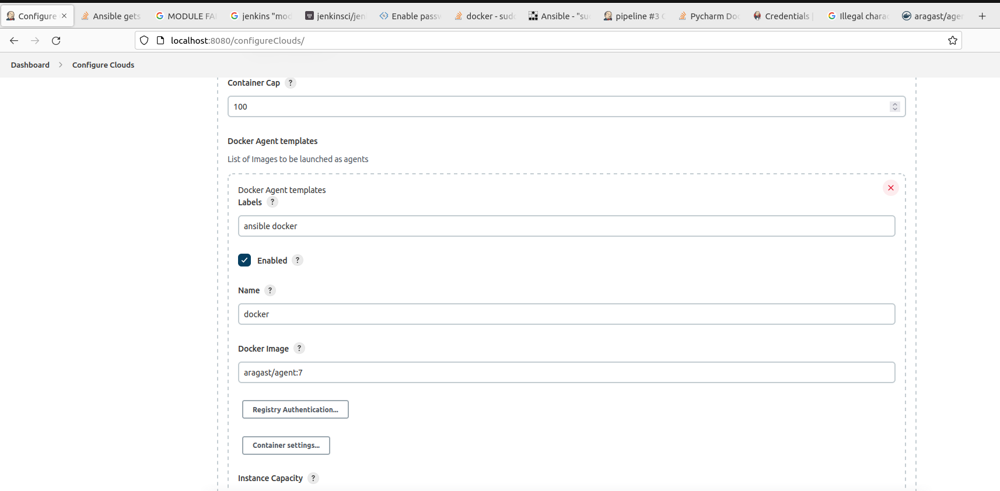

Сделан форк репозитория с [playbook](https://github.com/aragastmatb/example-playbook)

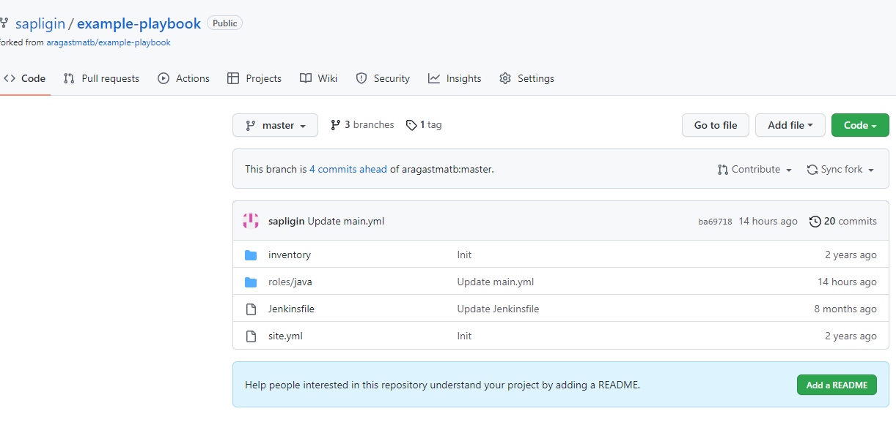

## Основная часть

1. Сделать Freestyle Job, который будет запускать `ansible-playbook` из форка репозитория
2. Сделать Declarative Pipeline, который будет выкачивать репозиторий с плейбукой и запускать её
3. Перенести Declarative Pipeline в репозиторий в файл `Jenkinsfile`
4. Перенастроить Job на использование `Jenkinsfile` из репозитория
5. Создать Scripted Pipeline, наполнить его скриптом из [pipeline](./pipeline)
6. Заменить credentialsId на свой собственный
7. Проверить работоспособность, исправить ошибки, исправленный Pipeline вложить в репозиторий в файл `ScriptedJenkinsfile`
8. Отправить ссылку на репозиторий в ответе

## Решение
Сделан Freestyle Job, который будет запускать `ansible-playbook` из форка репозитория

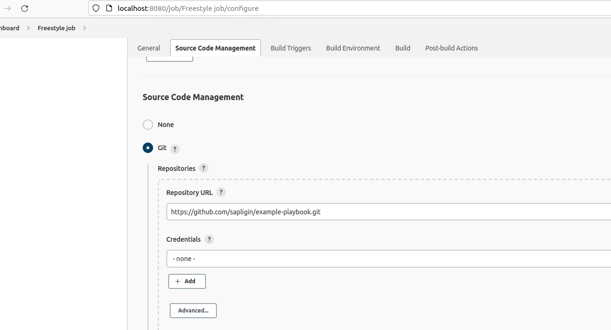

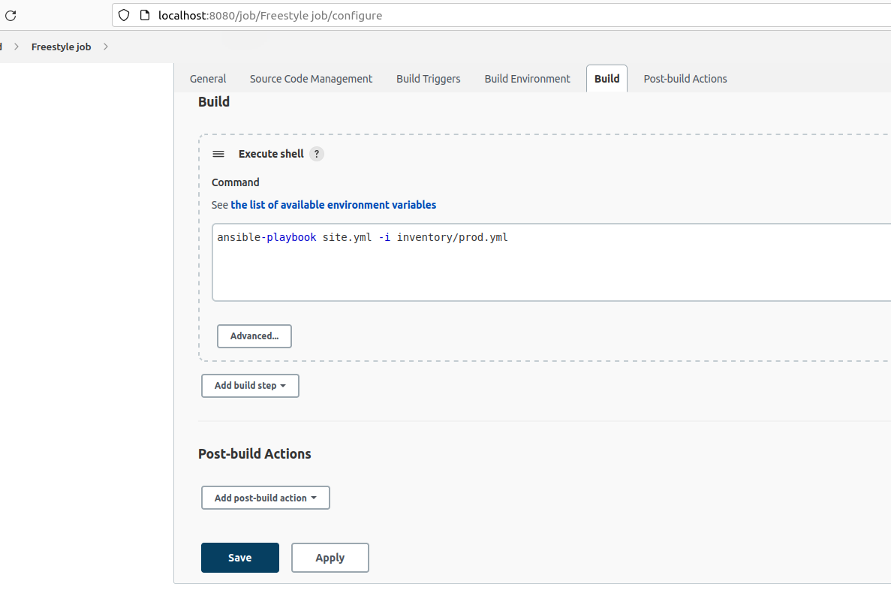

Так как playbook запускается локально, то пришлось его отредактировать, закомментировав в таске директиву `become: true`, иначе playbook завершается с ошибкой `"module_stderr": "sudo: a password is required\n"`

Freestyle Job завершился успешно

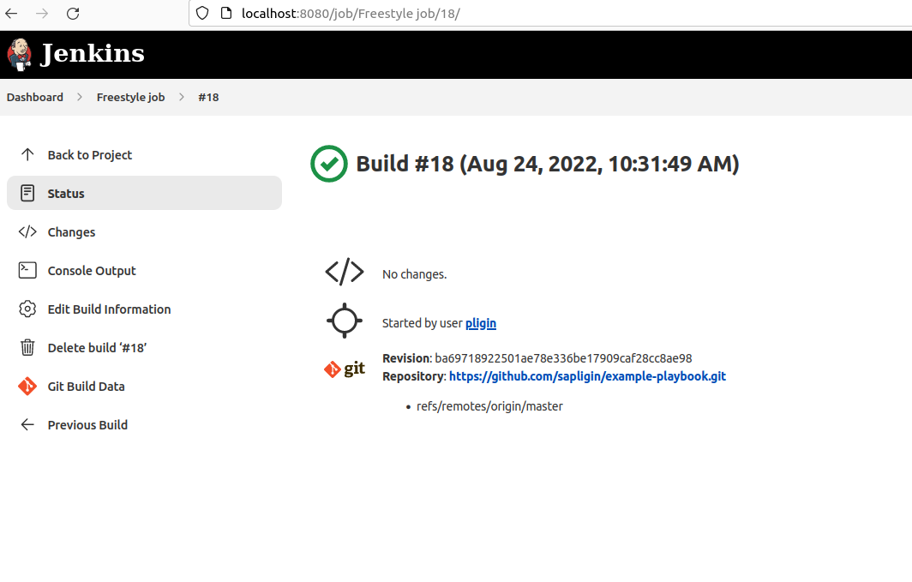

Вывод консоли Freestyle Job 
```commandline
Started by user pligin
Running as SYSTEM
Building in workspace /var/lib/jenkins/workspace/Freestyle job
Selected Git installation does not exist. Using Default
The recommended git tool is: NONE
No credentials specified
 > git rev-parse --resolve-git-dir /var/lib/jenkins/workspace/Freestyle job/.git # timeout=10
Fetching changes from the remote Git repository
 > git config remote.origin.url https://github.com/sapligin/example-playbook.git # timeout=10
Fetching upstream changes from https://github.com/sapligin/example-playbook.git
 > git --version # timeout=10
 > git --version # 'git version 2.34.1'
 > git fetch --tags --force --progress -- https://github.com/sapligin/example-playbook.git +refs/heads/*:refs/remotes/origin/* # timeout=10
 > git rev-parse refs/remotes/origin/master^{commit} # timeout=10
Checking out Revision ba69718922501ae78e336be17909caf28cc8ae98 (refs/remotes/origin/master)
 > git config core.sparsecheckout # timeout=10
 > git checkout -f ba69718922501ae78e336be17909caf28cc8ae98 # timeout=10
Commit message: "Update main.yml"
 > git rev-list --no-walk ba69718922501ae78e336be17909caf28cc8ae98 # timeout=10
[Freestyle job] $ /bin/sh -xe /tmp/jenkins9431551432141709780.sh
+ ansible-playbook site.yml -i inventory/prod.yml

PLAY [Install Java] ************************************************************

TASK [Gathering Facts] *********************************************************
ok: [localhost]

TASK [java : Upload .tar.gz file containing binaries from local storage] *******
skipping: [localhost]

TASK [java : Upload .tar.gz file conaining binaries from remote storage] *******
ok: [localhost]

TASK [java : Ensure installation dir exists] ***********************************
ok: [localhost]

TASK [java : Extract java in the installation directory] ***********************
skipping: [localhost]

TASK [java : Export environment variables] *************************************
ok: [localhost]

PLAY RECAP *********************************************************************
localhost                  : ok=4    changed=0    unreachable=0    failed=0    skipped=2    rescued=0    ignored=0   

Finished: SUCCESS

```

Сделан Declarative Pipeline, который будет выкачивать репозиторий с плейбукой и запускать её

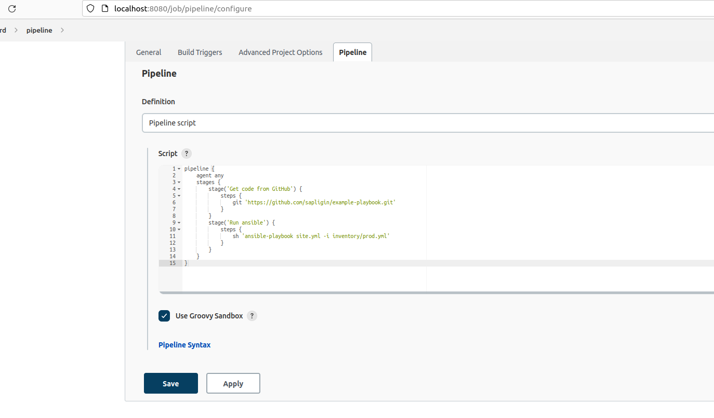

Declarative Pipeline отработал успешно

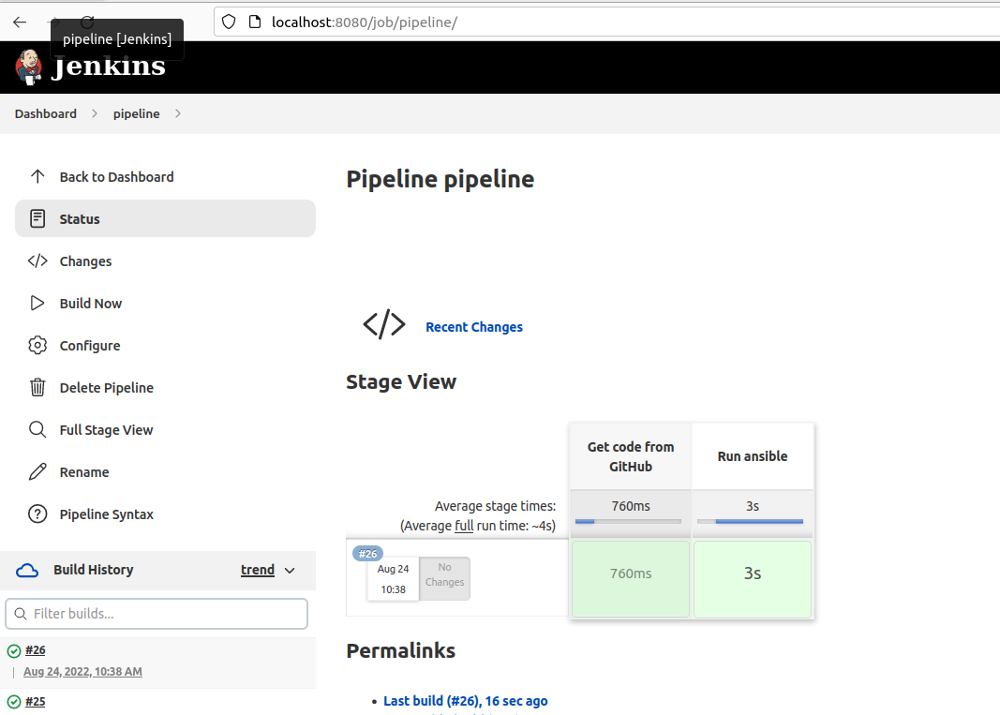

Declarative Pipeline перенесен в репозиторий в файл `Jenkinsfile`

Job перенастроен на использование `Jenkinsfile` из репозитория

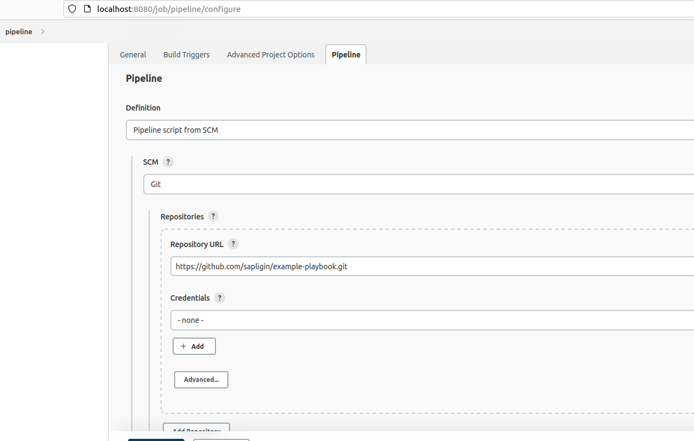

Job успешно отработал

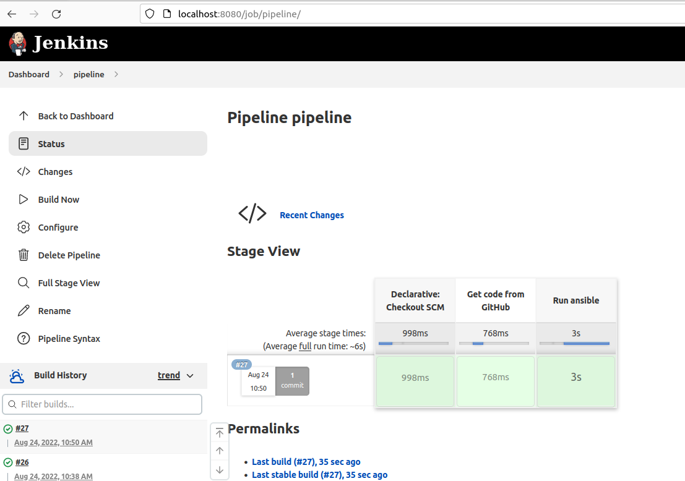

Создан Scripted Pipeline, наполнен скриптом из pipeline задания, credentialsId изменен на свой собственный.  
Так же в скрипте изменил ссылку на форк репозитория, так как в форке закомментированы в таске директивы `become: true`, иначе playbook завершается с ошибкой `"module_stderr": "sudo: a password is required\n"`

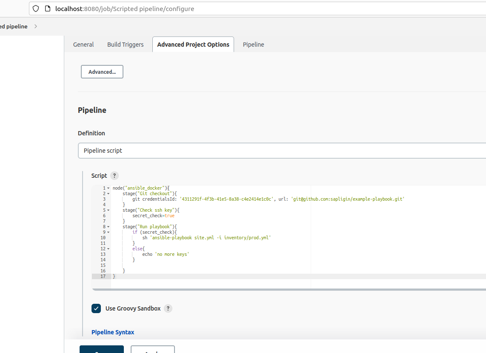

В результате Scripted Pipeline успешно отрабатывает


Лог консоли Scripted Pipeline
```commandline
Started by user pligin
[Pipeline] Start of Pipeline
[Pipeline] node
Running on Jenkins in /var/lib/jenkins/workspace/Scripted pipeline
[Pipeline] {
[Pipeline] stage
[Pipeline] { (Git checkout)
[Pipeline] git
Selected Git installation does not exist. Using Default
The recommended git tool is: NONE
using credential 4311291f-4f3b-41e5-8a38-c4e2414e1c0c
 > git rev-parse --resolve-git-dir /var/lib/jenkins/workspace/Scripted pipeline/.git # timeout=10
Fetching changes from the remote Git repository
 > git config remote.origin.url git@github.com:sapligin/example-playbook.git # timeout=10
Fetching upstream changes from git@github.com:sapligin/example-playbook.git
 > git --version # timeout=10
 > git --version # 'git version 2.34.1'
using GIT_ASKPASS to set credentials 
 > git fetch --tags --force --progress -- git@github.com:sapligin/example-playbook.git +refs/heads/*:refs/remotes/origin/* # timeout=10
 > git rev-parse refs/remotes/origin/master^{commit} # timeout=10
Checking out Revision 019d2ef2a54ec5b1c4fa87e59690dc37ec28ac0a (refs/remotes/origin/master)
 > git config core.sparsecheckout # timeout=10
 > git checkout -f 019d2ef2a54ec5b1c4fa87e59690dc37ec28ac0a # timeout=10
 > git branch -a -v --no-abbrev # timeout=10
 > git branch -D master # timeout=10
 > git checkout -b master 019d2ef2a54ec5b1c4fa87e59690dc37ec28ac0a # timeout=10
Commit message: "edited Jenkinsfile"
First time build. Skipping changelog.
[Pipeline] }
[Pipeline] // stage
[Pipeline] stage
[Pipeline] { (Check ssh key)
[Pipeline] }
[Pipeline] // stage
[Pipeline] stage
[Pipeline] { (Run playbook)
[Pipeline] sh
+ ansible-playbook site.yml -i inventory/prod.yml

PLAY [Install Java] ************************************************************

TASK [Gathering Facts] *********************************************************
ok: [localhost]

TASK [java : Upload .tar.gz file containing binaries from local storage] *******
skipping: [localhost]

TASK [java : Upload .tar.gz file conaining binaries from remote storage] *******
ok: [localhost]

TASK [java : Ensure installation dir exists] ***********************************
ok: [localhost]

TASK [java : Extract java in the installation directory] ***********************
skipping: [localhost]

TASK [java : Export environment variables] *************************************
ok: [localhost]

PLAY RECAP *********************************************************************
localhost                  : ok=4    changed=0    unreachable=0    failed=0    skipped=2    rescued=0    ignored=0   

[Pipeline] }
[Pipeline] // stage
[Pipeline] }
[Pipeline] // node
[Pipeline] End of Pipeline
Finished: SUCCESS

```

[Ссылка на форк репозитория example-playbook с изменениями](https://github.com/sapligin/example-playbook)