# Дипломный практикум Yandex Cloud
## 1. Регистрация доменного имени
Зарегистрировано доменное имя `sapligin.ru`
## 2. Создание инфраструктуры
В YC создан сервисный аккаунт `my-robot` с правами `editor`

Создан S3 bucket в аккаунте YC

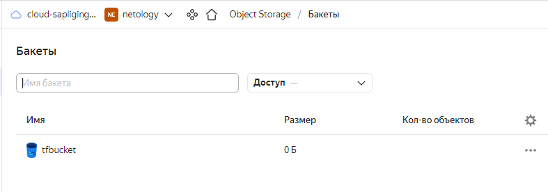

Пишем конфигурацию `terraform` с подсетями:
<details>
<summary>main.tf</summary>

```terraform
terraform {
  required_providers {
    yandex = {
      source = "yandex-cloud/yandex"
    }
  }


  backend "s3" {
    endpoint   = "storage.yandexcloud.net"
    bucket     = "tfbucket"
    region     = "ru-central1-a"
    key        = "tfbucket/terraform.tfstate"

    skip_region_validation      = true
    skip_credentials_validation = true
  }
}

provider "yandex" {
  service_account_key_file = "../key.json"
  cloud_id  = "b1gkps1kvm3lbn7tuqda"
  folder_id = "b1g17mdarsc1bia6qhjt"
  zone      = "ru-central1-a"
}
```

</details>

<details>
<summary>network.tf</summary>

```terraform
resource "yandex_vpc_network" "network" {
  name = "network"
}

resource "yandex_vpc_subnet" "private-subnet" {
  name           = "private-subnet"
  zone           = "ru-central1-a"
  network_id     = yandex_vpc_network.network.id
  v4_cidr_blocks = ["192.168.10.0/24"]
}

resource "yandex_vpc_subnet" "local-subnet" {
  name           = "local-subnet"
  zone           = "ru-central1-b"
  network_id     = yandex_vpc_network.network.id
  v4_cidr_blocks = ["192.168.20.0/24"]
}
```

</details>

Инициализируем `terraform`
<details>
<summary>terraform init</summary>

```commandline
pligin@ubuntu:~$ terraform init --backend-config="access_key=XXXXXXXXX-XxxXXX-xXX_xXxX" --backend-config="secret_key=XXX_XXXxxXXxxxxXXxXxxXxXXxxXXxXxXxXXx-x"

Initializing the backend...

Successfully configured the backend "s3"! Terraform will automatically
use this backend unless the backend configuration changes.

Initializing provider plugins...
- Finding latest version of yandex-cloud/yandex...
- Installing yandex-cloud/yandex v0.76.0...
- Installed yandex-cloud/yandex v0.76.0 (unauthenticated)

Terraform has created a lock file .terraform.lock.hcl to record the provider
selections it made above. Include this file in your version control repository
so that Terraform can guarantee to make the same selections by default when
you run "terraform init" in the future.

Terraform has been successfully initialized!

You may now begin working with Terraform. Try running "terraform plan" to see
any changes that are required for your infrastructure. All Terraform commands
should now work.

If you ever set or change modules or backend configuration for Terraform,
rerun this command to reinitialize your working directory. If you forget, other
commands will detect it and remind you to do so if necessary.

```
</details>

<details>
<summary>Создаем `workspace` `stage`</summary>

```commandline
pligin@ubuntu:~/Desktop/devops-diplom-yandexcloud/terraform$ terraform workspace new stage
Created and switched to workspace "stage"!

You're now on a new, empty workspace. Workspaces isolate their state,
so if you run "terraform plan" Terraform will not see any existing state
for this configuration.
pligin@ubuntu:~/Desktop/devops-diplom-yandexcloud/terraform$ terraform workspace list 
  default
* stage

```
</details>

В результате команды `terraform plan` и `terraform apply -auto-approve` отрабатывают без ошибок.
<details>
<summary>terraform plan</summary>

```commandline
pligin@ubuntu:~/Desktop/devops-diplom-yandexcloud/terraform$ terraform plan 

Terraform used the selected providers to generate the following execution plan. Resource actions are indicated with
the following symbols:
  + create

Terraform will perform the following actions:

  # yandex_vpc_network.network will be created
  + resource "yandex_vpc_network" "network" {
      + created_at                = (known after apply)
      + default_security_group_id = (known after apply)
      + folder_id                 = (known after apply)
      + id                        = (known after apply)
      + labels                    = (known after apply)
      + name                      = "network"
      + subnet_ids                = (known after apply)
    }

  # yandex_vpc_subnet.local-subnet will be created
  + resource "yandex_vpc_subnet" "local-subnet" {
      + created_at     = (known after apply)
      + folder_id      = (known after apply)
      + id             = (known after apply)
      + labels         = (known after apply)
      + name           = "local-subnet"
      + network_id     = (known after apply)
      + v4_cidr_blocks = [
          + "192.168.20.0/24",
        ]
      + v6_cidr_blocks = (known after apply)
      + zone           = "ru-central1-b"
    }

  # yandex_vpc_subnet.private-subnet will be created
  + resource "yandex_vpc_subnet" "private-subnet" {
      + created_at     = (known after apply)
      + folder_id      = (known after apply)
      + id             = (known after apply)
      + labels         = (known after apply)
      + name           = "private-subnet"
      + network_id     = (known after apply)
      + v4_cidr_blocks = [
          + "192.168.10.0/24",
        ]
      + v6_cidr_blocks = (known after apply)
      + zone           = "ru-central1-a"
    }

Plan: 3 to add, 0 to change, 0 to destroy.

──────────────────────────────────────────────────────────────────────────────────────────────────────────────────────

Note: You didn't use the -out option to save this plan, so Terraform can't guarantee to take exactly these actions if
you run "terraform apply" now.

```
</details>

<details>
<summary>terraform apply</summary>

```commandline
pligin@ubuntu:~/Desktop/devops-diplom-yandexcloud/terraform$ terraform apply -auto-approve

Terraform used the selected providers to generate the following execution plan. Resource actions are indicated with
the following symbols:
  + create

Terraform will perform the following actions:

  # yandex_vpc_network.network will be created
  + resource "yandex_vpc_network" "network" {
      + created_at                = (known after apply)
      + default_security_group_id = (known after apply)
      + folder_id                 = (known after apply)
      + id                        = (known after apply)
      + labels                    = (known after apply)
      + name                      = "network"
      + subnet_ids                = (known after apply)
    }

  # yandex_vpc_subnet.local-subnet will be created
  + resource "yandex_vpc_subnet" "local-subnet" {
      + created_at     = (known after apply)
      + folder_id      = (known after apply)
      + id             = (known after apply)
      + labels         = (known after apply)
      + name           = "local-subnet"
      + network_id     = (known after apply)
      + v4_cidr_blocks = [
          + "192.168.20.0/24",
        ]
      + v6_cidr_blocks = (known after apply)
      + zone           = "ru-central1-b"
    }

  # yandex_vpc_subnet.private-subnet will be created
  + resource "yandex_vpc_subnet" "private-subnet" {
      + created_at     = (known after apply)
      + folder_id      = (known after apply)
      + id             = (known after apply)
      + labels         = (known after apply)
      + name           = "private-subnet"
      + network_id     = (known after apply)
      + v4_cidr_blocks = [
          + "192.168.10.0/24",
        ]
      + v6_cidr_blocks = (known after apply)
      + zone           = "ru-central1-a"
    }

Plan: 3 to add, 0 to change, 0 to destroy.

yandex_vpc_network.network: Creating...
yandex_vpc_network.network: Creation complete after 1s [id=enp7vdqdg0rr5ogq1qdm]
yandex_vpc_subnet.private-subnet: Creating...
yandex_vpc_subnet.local-subnet: Creating...
yandex_vpc_subnet.local-subnet: Creation complete after 1s [id=e2ltokvn53eck93mara9]
yandex_vpc_subnet.private-subnet: Creation complete after 2s [id=e9bdki9s6ujhht8olife]

Apply complete! Resources: 3 added, 0 changed, 0 destroyed.
```
</details>

В аккаунте YC создаются подсети:

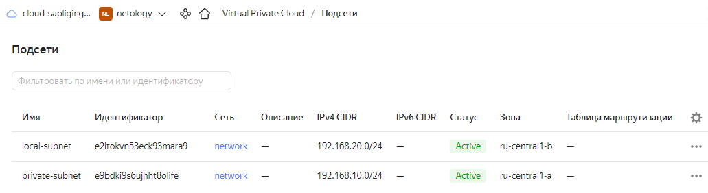

В S3 bucket пишется состояние конфигурации `terraform`

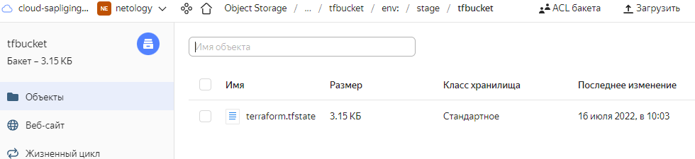

Команда `terraform destroy -auto-approve` уничтожает инфраструктуру без дополнительных запросов:
<details>
<summary>terraform destroy</summary>

```commandline
pligin@ubuntu:~/Desktop/devops-diplom-yandexcloud/terraform$ terraform destroy 
yandex_vpc_network.network: Refreshing state... [id=enp7vdqdg0rr5ogq1qdm]
yandex_vpc_subnet.private-subnet: Refreshing state... [id=e9bdki9s6ujhht8olife]
yandex_vpc_subnet.local-subnet: Refreshing state... [id=e2ltokvn53eck93mara9]

Terraform used the selected providers to generate the following execution plan. Resource actions are indicated with
the following symbols:
  - destroy

Terraform will perform the following actions:

  # yandex_vpc_network.network will be destroyed
  - resource "yandex_vpc_network" "network" {
      - created_at = "2022-07-16T07:03:47Z" -> null
      - folder_id  = "b1g17mdarsc1bia6qhjt" -> null
      - id         = "enp7vdqdg0rr5ogq1qdm" -> null
      - labels     = {} -> null
      - name       = "network" -> null
      - subnet_ids = [
          - "e2ltokvn53eck93mara9",
          - "e9bdki9s6ujhht8olife",
        ] -> null
    }

  # yandex_vpc_subnet.local-subnet will be destroyed
  - resource "yandex_vpc_subnet" "local-subnet" {
      - created_at     = "2022-07-16T07:03:48Z" -> null
      - folder_id      = "b1g17mdarsc1bia6qhjt" -> null
      - id             = "e2ltokvn53eck93mara9" -> null
      - labels         = {} -> null
      - name           = "local-subnet" -> null
      - network_id     = "enp7vdqdg0rr5ogq1qdm" -> null
      - v4_cidr_blocks = [
          - "192.168.20.0/24",
        ] -> null
      - v6_cidr_blocks = [] -> null
      - zone           = "ru-central1-b" -> null
    }

  # yandex_vpc_subnet.private-subnet will be destroyed
  - resource "yandex_vpc_subnet" "private-subnet" {
      - created_at     = "2022-07-16T07:03:49Z" -> null
      - folder_id      = "b1g17mdarsc1bia6qhjt" -> null
      - id             = "e9bdki9s6ujhht8olife" -> null
      - labels         = {} -> null
      - name           = "private-subnet" -> null
      - network_id     = "enp7vdqdg0rr5ogq1qdm" -> null
      - v4_cidr_blocks = [
          - "192.168.10.0/24",
        ] -> null
      - v6_cidr_blocks = [] -> null
      - zone           = "ru-central1-a" -> null
    }

Plan: 0 to add, 0 to change, 3 to destroy.

yandex_vpc_subnet.private-subnet: Destroying... [id=e9bdki9s6ujhht8olife]
yandex_vpc_subnet.local-subnet: Destroying... [id=e2ltokvn53eck93mara9]
yandex_vpc_subnet.private-subnet: Destruction complete after 2s
yandex_vpc_subnet.local-subnet: Destruction complete after 4s
yandex_vpc_network.network: Destroying... [id=enp7vdqdg0rr5ogq1qdm]
yandex_vpc_network.network: Destruction complete after 0s

Destroy complete! Resources: 3 destroyed.

```
</details>

## 3. Установка Nginx и LetsEncrypt
Написана роль для установки Nginx и LetsEncrypt.

В Яндекс.Облаке зарезервирован внешний IP-адрес для сервера c Nginx (51.250.12.153)

В доменной зоне настроены все A-записи на внешний адрес сервера c Nginx (51.250.12.153)

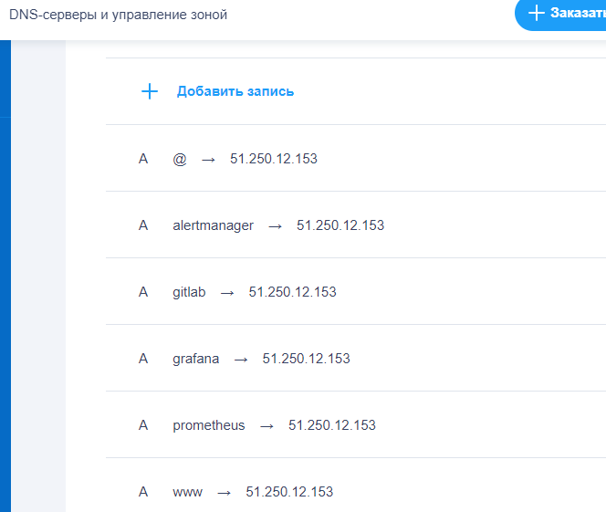

В браузере можно открыть любой URL и увидеть ответ сервера (502 Bad Gateway). Также certbot сгенерировал сертификат:

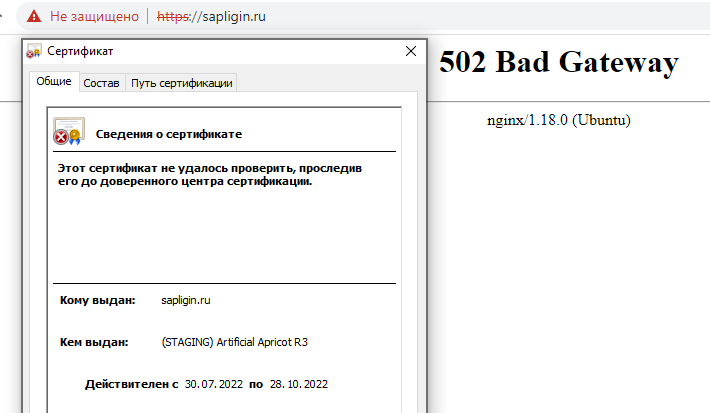

## 4. Установка кластера MySQL

У меня не получилось посредством Ansible настроить репликацию master и slave, так как в модуле `mysql_replication` не предусмотрен параметр `GET_MASTER_PUBLIC_KEY` для безопасной аутентификации. Поэтому настраивал репликацию в ручную.

Для настройки репликации вручную запастил на сервере master команду `show master status` и запомнил параметры `File` и `Position`
<details>
<summary>show master status</summary>

```commandline
mysql> show master status;
+------------------+----------+--------------+------------------+-------------------+
| File             | Position | Binlog_Do_DB | Binlog_Ignore_DB | Executed_Gtid_Set |
+------------------+----------+--------------+------------------+-------------------+
| mysql-bin.000001 |      157 | wordpress    |                  |                   |
+------------------+----------+--------------+------------------+-------------------+
1 row in set (0.00 sec)

```
</details>
На сервере db02.sapligin.ru для настройки репликации ввел команды

<details>
<summary>Настройка реплики на сервере db02.sapligin.ru</summary>

```commandline
# останавливаем реплику
mysql - stop slave;

# сьрасываем реплику
mysql > reset slave;

# настраиваем реплику заново с параметрами мастера
mysql> CHANGE MASTER TO
    -> GET_MASTER_PUBLIC_KEY=1,
    -> MASTER_HOST='192.168.20.7',
    -> MASTER_USER='replica_user',
    -> MASTER_PASSWORD='repl1c@tPa$$w0rD',
    -> MASTER_LOG_FILE='mysql-bin.000001',
    -> MASTER_LOG_POS=751;
Query OK, 0 rows affected, 8 warnings (0.06 sec)

# стартуем реплику
mysql> start slave;
```
</details>

<details>
<summary>Проверяем работу сервера реплики:</summary>

```commandline
mysql> show slave status \G;
*************************** 1. row ***************************
               Slave_IO_State: Waiting for source to send event
                  Master_Host: 192.168.20.12
                  Master_User: replica_user
                  Master_Port: 3306
                Connect_Retry: 60
              Master_Log_File: mysql-bin.000001
          Read_Master_Log_Pos: 752
               Relay_Log_File: mysql-relay-bin.000002
                Relay_Log_Pos: 326
        Relay_Master_Log_File: mysql-bin.000001
             Slave_IO_Running: Yes
            Slave_SQL_Running: Yes
              Replicate_Do_DB: 
          Replicate_Ignore_DB: 
           Replicate_Do_Table: 
       Replicate_Ignore_Table: 
      Replicate_Wild_Do_Table: 
  Replicate_Wild_Ignore_Table: 
                   Last_Errno: 0
                   Last_Error: 
                 Skip_Counter: 0
          Exec_Master_Log_Pos: 752
              Relay_Log_Space: 536
              Until_Condition: None
               Until_Log_File: 
                Until_Log_Pos: 0
           Master_SSL_Allowed: No
           Master_SSL_CA_File: 
           Master_SSL_CA_Path: 
              Master_SSL_Cert: 
            Master_SSL_Cipher: 
               Master_SSL_Key: 
        Seconds_Behind_Master: 0
Master_SSL_Verify_Server_Cert: No
                Last_IO_Errno: 0
                Last_IO_Error: 
               Last_SQL_Errno: 0
               Last_SQL_Error: 
  Replicate_Ignore_Server_Ids: 
             Master_Server_Id: 11
                  Master_UUID: 1a9afbd0-1a38-11ed-83e2-d00d18ae1e1d
             Master_Info_File: mysql.slave_master_info
                    SQL_Delay: 0
          SQL_Remaining_Delay: NULL
      Slave_SQL_Running_State: Replica has read all relay log; waiting for more updates
           Master_Retry_Count: 86400
                  Master_Bind: 
      Last_IO_Error_Timestamp: 
     Last_SQL_Error_Timestamp: 
               Master_SSL_Crl: 
           Master_SSL_Crlpath: 
           Retrieved_Gtid_Set: 
            Executed_Gtid_Set: 
                Auto_Position: 0
         Replicate_Rewrite_DB: 
                 Channel_Name: 
           Master_TLS_Version: 
       Master_public_key_path: 
        Get_master_public_key: 1
            Network_Namespace: 
1 row in set, 1 warning (0.01 sec)
```
</details>

Далее провожу окончательную настройку в web-интерфейсе сайта wordpress, и проверяю создаются ли таблицы на обоих серверах mysql.

<details>
<summary>До настройки:</summary>

```commandline
ubuntu@db01:~$ sudo mysql
Welcome to the MySQL monitor.  Commands end with ; or \g.
Your MySQL connection id is 99
Server version: 8.0.30-0ubuntu0.20.04.2 (Ubuntu)

Copyright (c) 2000, 2022, Oracle and/or its affiliates.

Oracle is a registered trademark of Oracle Corporation and/or its
affiliates. Other names may be trademarks of their respective
owners.

Type 'help;' or '\h' for help. Type '\c' to clear the current input statement.

mysql> use wordpress;
Database changed
mysql> show tables
    -> ;
Empty set (0.01 sec)

```
```commandline
ubuntu@db02:~$ sudo mysql
mysql> use wordpress
Database changed
mysql> show tables;
Empty set (0.01 sec)
```
</details>

<details>
<summary>После настройки</summary>

```commandline
ubuntu@db01:~$ sudo mysql
mysql> use wordpress;
Reading table information for completion of table and column names
You can turn off this feature to get a quicker startup with -A

Database changed
mysql> show tables
    -> ;
+-----------------------+
| Tables_in_wordpress   |
+-----------------------+
| wp_commentmeta        |
| wp_comments           |
| wp_links              |
| wp_options            |
| wp_postmeta           |
| wp_posts              |
| wp_term_relationships |
| wp_term_taxonomy      |
| wp_termmeta           |
| wp_terms              |
| wp_usermeta           |
| wp_users              |
+-----------------------+
12 rows in set (0.00 sec)

```
Сервер db02
```commandline
```commandline
ubuntu@db02:~$ sudo mysql
mysql> use wordpress;
Reading table information for completion of table and column names
You can turn off this feature to get a quicker startup with -A

Database changed
mysql> show tables
    -> ;
+-----------------------+
| Tables_in_wordpress   |
+-----------------------+
| wp_commentmeta        |
| wp_comments           |
| wp_links              |
| wp_options            |
| wp_postmeta           |
| wp_posts              |
| wp_term_relationships |
| wp_term_taxonomy      |
| wp_termmeta           |
| wp_terms              |
| wp_usermeta           |
| wp_users              |
+-----------------------+
12 rows in set (0.00 sec)

```
</details>

## 5. Установка Wordpress
Написана роль для установки Wordpress

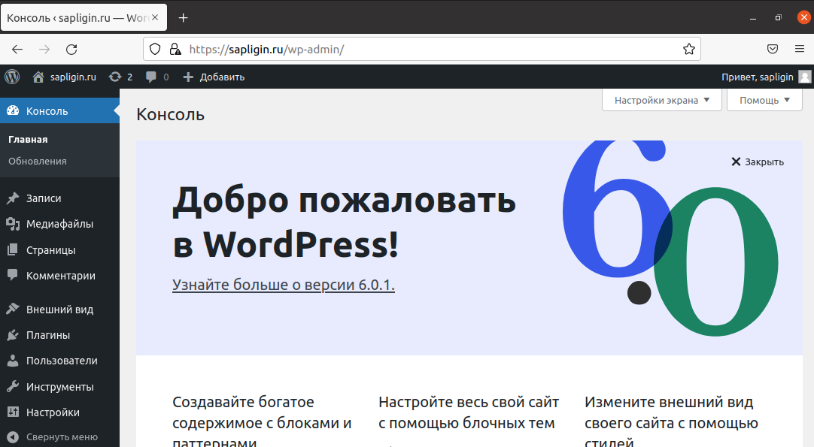

## 6. Установка Gitlab CE и Gitlab Runner

Написаны роли для установки Gitlab CE и gitlab-runner.

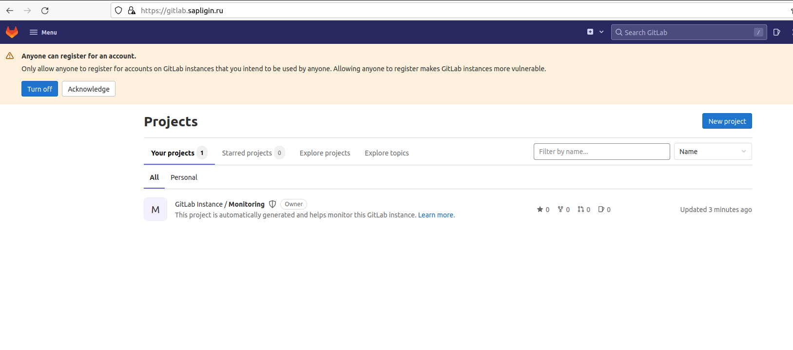

Регистрируем вручную gitlab-runner
```commandline
ubuntu@runner:~$ sudo gitlab-runner register
Runtime platform                                    arch=amd64 os=linux pid=1203 revision=32fc1585 version=15.2.1
Running in system-mode.                            
                                                   
Enter the GitLab instance URL (for example, https://gitlab.com/):
http://gitlab.sapligin.ru
Enter the registration token:
GR1348941RS9m2j1dJeCBwxQKmyoA
Enter a description for the runner:
[runner]: my runner
Enter tags for the runner (comma-separated):
v1.0.0,v1.0.1,v1.0.2
Enter optional maintenance note for the runner:

Registering runner... succeeded                     runner=GR1348941RS9m2j1d
Enter an executor: docker, parallels, docker+machine, docker-ssh+machine, kubernetes, custom, shell, ssh, virtualbox, docker-ssh:
shell
Runner registered successfully. Feel free to start it, but if it's running already the config should be automatically reloaded!
 
Configuration (with the authentication token) was saved in "/etc/gitlab-runner/config.toml" 
```
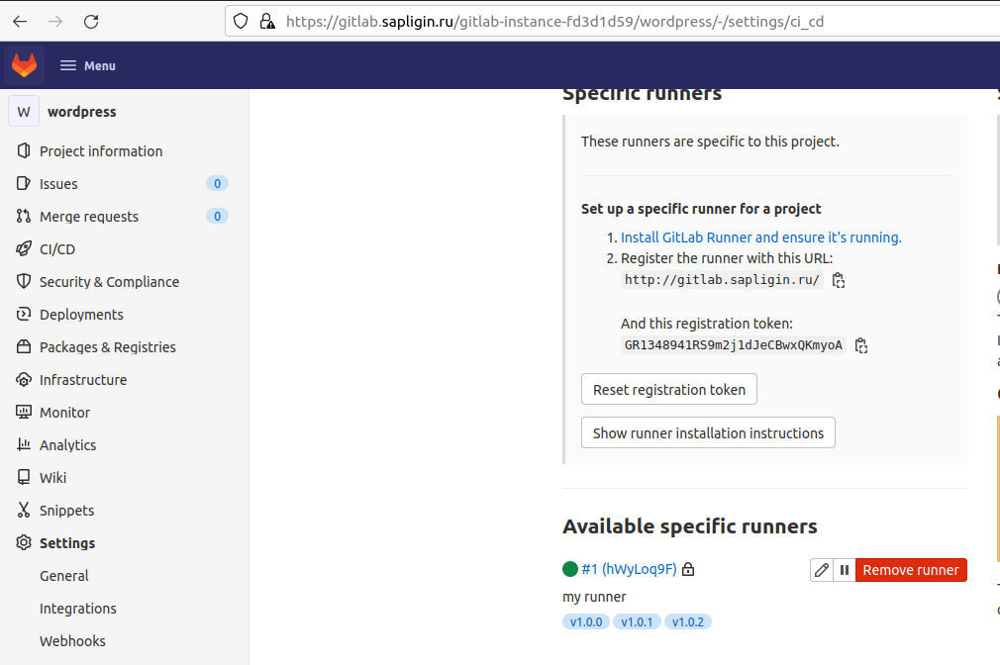

Деплой на сервер app.sapligin.ru при добавлении тегов идет с помощью установленного и настроенного `rsync` на сервере `app` и сервере `runner`.

Написан pipeline для синхронизации репозитория с папкой сайта на сервере `app.sapligin.ru`

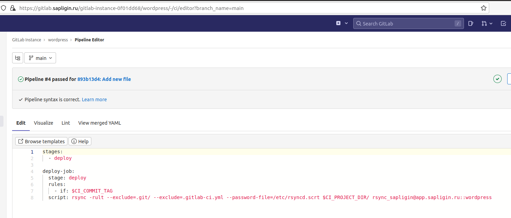

Проверяем работу доставки в среду эксплуатации:

Создаем в репозитории файл `test.txt`

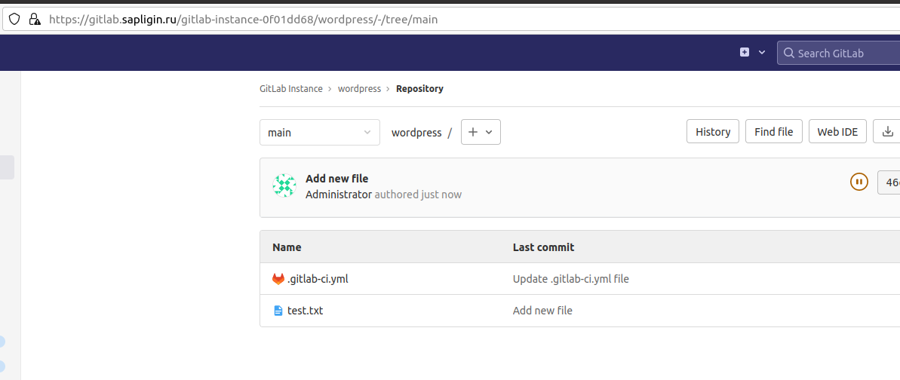

Создаем в репозитори тэг `v1.0.0`

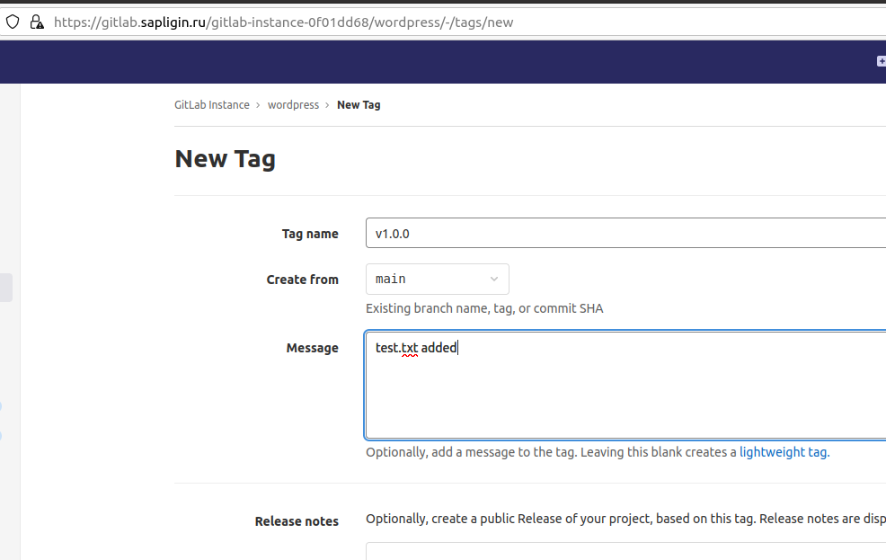

Видим, что пайплайн отработал без ошибок.

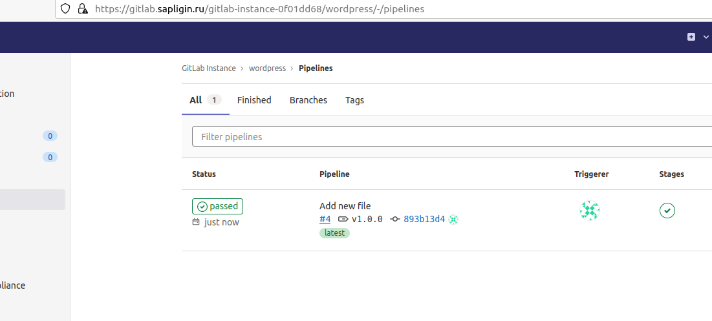

Монитор задачи деплоя

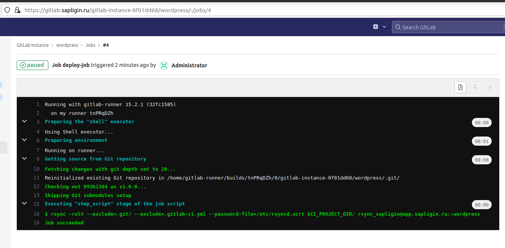

На сервере app.sapligin.ru появился файл `test.txt`

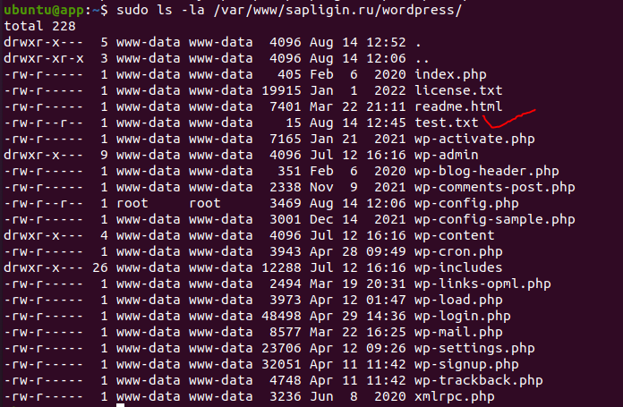

## 7. Установка Prometheus, Alert Manager, Node Exporter и Grafana
Prometheus и метрики

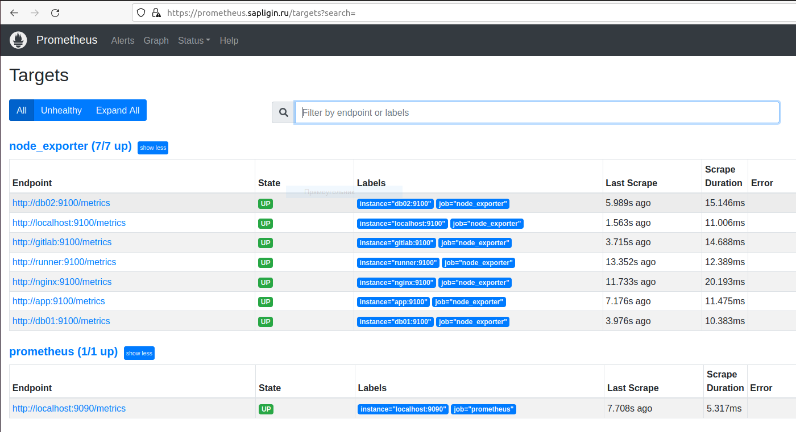

Dashboard Grafana

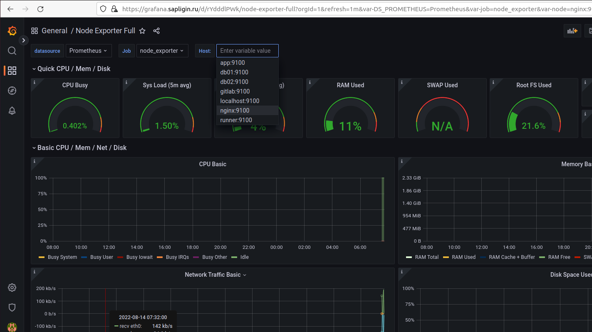

При выключении хостов Alertmanager сигнализирует об этом

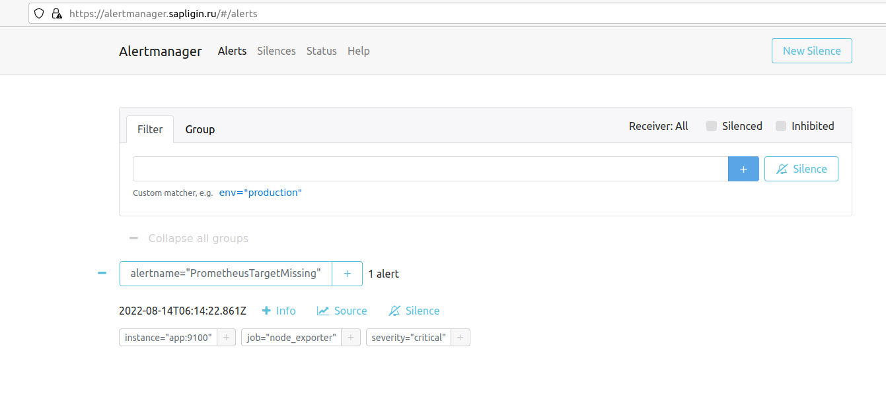