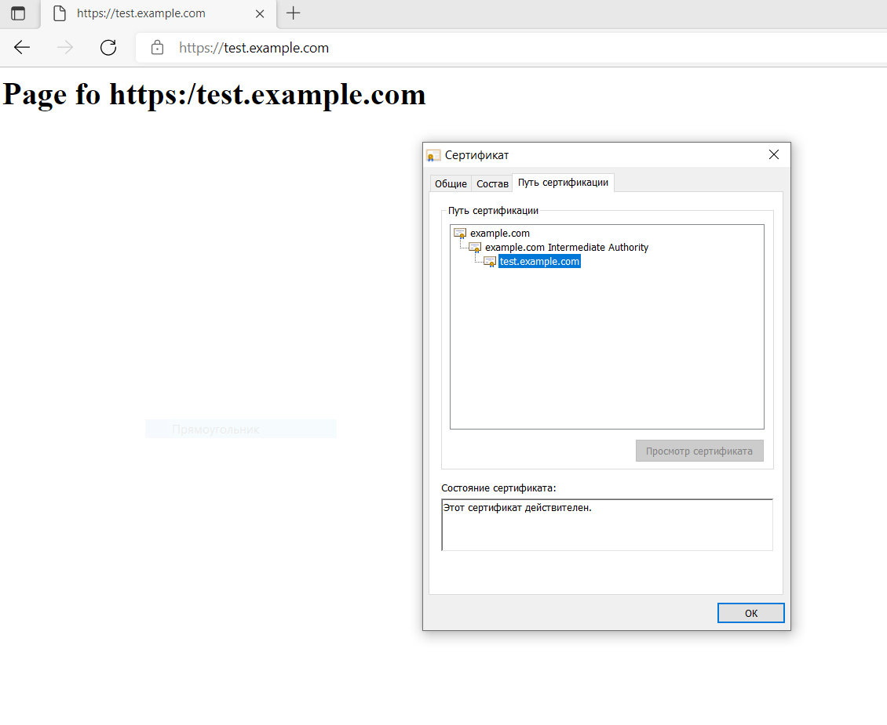

# Курсовая работа по итогам модуля "DevOps и системное администрирование"


## Процесс установки и настройки ufw:
```
vagrant@vagrant:~$ sudo ufw status
Status: inactive
vagrant@vagrant:~$ sudo ufw enable
Command may disrupt existing ssh connections. Proceed with operation (y|n)? y
Firewall is active and enabled on system startup
vagrant@vagrant:~$ sudo ufw allow 22
Rule added
Rule added (v6)
vagrant@vagrant:~$ sudo ufw allow 443
Rule added
Rule added (v6)
vagrant@vagrant:~$ sudo ufw status
Status: active

To                         Action      From
--                         ------      ----
22                         ALLOW       Anywhere
443                        ALLOW       Anywhere
22 (v6)                    ALLOW       Anywhere (v6)
443 (v6)                   ALLOW       Anywhere (v6)
```
  
# Процесс установки и выпуска сертификата с помощью hashicorp vault:
Устанавливаем hashicorp vault командами
```
vagrant@vagrant:~$ curl -fsSL https://apt.releases.hashicorp.com/gpg | sudo apt-key add -
vagrant@vagrant:~$ sudo apt-add-repository "deb [arch=amd64] https://apt.releases.hashicorp.com $(lsb_release -cs) main"
vagrant@vagrant:~$ sudo apt-get update && sudo apt-get install vault
```
Проверяем установку vault в отдельном окне терминала
```
vagrant@vagrant:~$ vault
Usage: vault <command> [args]

Common commands:
    read        Read data and retrieves secrets
    write       Write data, configuration, and secrets
    delete      Delete secrets and configuration
    list        List data or secrets
    login       Authenticate locally
    agent       Start a Vault agent
    server      Start a Vault server
    status      Print seal and HA status
    unwrap      Unwrap a wrapped secret

Other commands:
    audit          Interact with audit devices
    auth           Interact with auth methods
    debug          Runs the debug command
    kv             Interact with Vault's Key-Value storage
    lease          Interact with leases
    monitor        Stream log messages from a Vault server
    namespace      Interact with namespaces
    operator       Perform operator-specific tasks
    path-help      Retrieve API help for paths
    plugin         Interact with Vault plugins and catalog
    policy         Interact with policies
    print          Prints runtime configurations
    secrets        Interact with secrets engines
    ssh            Initiate an SSH session
    token          Interact with tokens
```
Устанавливаем jq
```
vagrant@vagrant:~$ sudo apt-get install jq
```
Запускаем в отдельном терминале vault в dev режиме с корневым токеном root
```
vagrant@vagrant:~$ vault server -dev -dev-root-token-id root
==> Vault server configuration:

             Api Address: http://127.0.0.1:8200
                     Cgo: disabled
         Cluster Address: https://127.0.0.1:8201
              Go Version: go1.17.5
              Listener 1: tcp (addr: "127.0.0.1:8200", cluster address: "127.0.0.1:8201", max_request_duration: "1m30s", max_request_size: "33554432", tls: "disabled")
               Log Level: info
                   Mlock: supported: true, enabled: false
           Recovery Mode: false
                 Storage: inmem
                 Version: Vault v1.9.2
             Version Sha: f4c6d873e2767c0d6853b5d9ffc77b0d297bfbdf

==> Vault server started! Log data will stream in below:

2022-01-14T07:41:42.419Z [INFO]  proxy environment: http_proxy="\"\"" https_proxy="\"\"" no_proxy="\"\""
2022-01-14T07:41:42.420Z [WARN]  no `api_addr` value specified in config or in VAULT_API_ADDR; falling back to detection if possible, but this value should be manually set
2022-01-14T07:41:42.420Z [INFO]  core: Initializing VersionTimestamps for core
2022-01-14T07:41:42.424Z [INFO]  core: security barrier not initialized
2022-01-14T07:41:42.424Z [INFO]  core: security barrier initialized: stored=1 shares=1 threshold=1
2022-01-14T07:41:42.424Z [INFO]  core: post-unseal setup starting
2022-01-14T07:41:42.432Z [INFO]  core: loaded wrapping token key
2022-01-14T07:41:42.432Z [INFO]  core: Recorded vault version: vault version=1.9.2 upgrade time="2022-01-14 07:41:42.432792038 +0000 UTC m=+0.064859269"
2022-01-14T07:41:42.432Z [INFO]  core: successfully setup plugin catalog: plugin-directory="\"\""
2022-01-14T07:41:42.433Z [INFO]  core: no mounts; adding default mount table
2022-01-14T07:41:42.435Z [INFO]  core: successfully mounted backend: type=cubbyhole path=cubbyhole/
2022-01-14T07:41:42.435Z [INFO]  core: successfully mounted backend: type=system path=sys/
2022-01-14T07:41:42.436Z [INFO]  core: successfully mounted backend: type=identity path=identity/
2022-01-14T07:41:42.439Z [INFO]  core: successfully enabled credential backend: type=token path=token/
2022-01-14T07:41:42.439Z [INFO]  rollback: starting rollback manager
2022-01-14T07:41:42.440Z [INFO]  core: restoring leases
2022-01-14T07:41:42.441Z [INFO]  expiration: lease restore complete
2022-01-14T07:41:42.442Z [INFO]  identity: entities restored
2022-01-14T07:41:42.442Z [INFO]  identity: groups restored
2022-01-14T07:41:42.442Z [INFO]  core: post-unseal setup complete
2022-01-14T07:41:42.446Z [INFO]  core: root token generated
2022-01-14T07:41:42.446Z [INFO]  core: pre-seal teardown starting
2022-01-14T07:41:42.446Z [INFO]  rollback: stopping rollback manager
2022-01-14T07:41:42.446Z [INFO]  core: pre-seal teardown complete
2022-01-14T07:41:42.447Z [INFO]  core.cluster-listener.tcp: starting listener: listener_address=127.0.0.1:8201
2022-01-14T07:41:42.447Z [INFO]  core.cluster-listener: serving cluster requests: cluster_listen_address=127.0.0.1:8201
2022-01-14T07:41:42.447Z [INFO]  core: post-unseal setup starting
2022-01-14T07:41:42.447Z [INFO]  core: loaded wrapping token key
2022-01-14T07:41:42.447Z [INFO]  core: successfully setup plugin catalog: plugin-directory="\"\""
2022-01-14T07:41:42.448Z [INFO]  core: successfully mounted backend: type=system path=sys/
2022-01-14T07:41:42.449Z [INFO]  core: successfully mounted backend: type=identity path=identity/
2022-01-14T07:41:42.449Z [INFO]  core: successfully mounted backend: type=cubbyhole path=cubbyhole/
2022-01-14T07:41:42.452Z [INFO]  core: successfully enabled credential backend: type=token path=token/
2022-01-14T07:41:42.453Z [INFO]  rollback: starting rollback manager
2022-01-14T07:41:42.454Z [INFO]  core: restoring leases
2022-01-14T07:41:42.454Z [INFO]  identity: entities restored
2022-01-14T07:41:42.454Z [INFO]  identity: groups restored
2022-01-14T07:41:42.454Z [INFO]  core: post-unseal setup complete
2022-01-14T07:41:42.454Z [INFO]  core: vault is unsealed
2022-01-14T07:41:42.454Z [INFO]  expiration: lease restore complete
2022-01-14T07:41:42.457Z [INFO]  expiration: revoked lease: lease_id=auth/token/root/h219ff93149acfb5c0920835f1ce35a20c67520703252c4357bcc217997306873
2022-01-14T07:41:42.461Z [INFO]  core: successful mount: namespace="\"\"" path=secret/ type=kv
2022-01-14T07:41:42.471Z [INFO]  secrets.kv.kv_ca91d6e0: collecting keys to upgrade
2022-01-14T07:41:42.471Z [INFO]  secrets.kv.kv_ca91d6e0: done collecting keys: num_keys=1
2022-01-14T07:41:42.471Z [INFO]  secrets.kv.kv_ca91d6e0: upgrading keys finished
WARNING! dev mode is enabled! In this mode, Vault runs entirely in-memory
and starts unsealed with a single unseal key. The root token is already
authenticated to the CLI, so you can immediately begin using Vault.

You may need to set the following environment variable:

    $ export VAULT_ADDR='http://127.0.0.1:8200'

The unseal key and root token are displayed below in case you want to
seal/unseal the Vault or re-authenticate.

Unseal Key: HGrF6U0GFqbjOUakoTolCXKtMfh/xulqxNZsLGOZIGA=
Root Token: root

Development mode should NOT be used in production installations!
```
Экспортируем переменную среды для обращения к серверу vault
```
vagrant@vagrant:~$ export VAULT_ADDR=http://127.0.0.1:8200
```
Экспортируем переменную среды для аутентификации на сервере vault
```
vagrant@vagrant:~$ export VAULT_TOKEN=root
```
### Создаем корневой Центр сертификации
Включаем pki
```
vagrant@vagrant:~$ vault secrets enable pki
Success! Enabled the pki secrets engine at: pki/
```
Настраиваем pki на выдачу сертификатов с максимальным TTL 87 600 часов
```
vagrant@vagrant:~$ vault secrets tune -max-lease-ttl=87600h pki
Success! Tuned the secrets engine at: pki/
```
Создаем корневой сертификат
```
vagrant@vagrant:~$ vault write -field=certificate pki/root/generate/internal \
>      common_name="example.com" \
>      ttl=87600h > CA_cert.crt
```
Настраиваем URL-адреса CA и CRL
```
vagrant@vagrant:~$ vault write pki/config/urls      issuing_certificates="$VAULT_ADDR/v1/pki/ca"      crl_distribution_points="$VAULT_ADDR/v1/pki/crl"
Success! Data written to: pki/config/urls
```
### Создаем промежуточный Центр сертификации
Включаем механизм pki по пути pki_int
```
vagrant@vagrant:~$ vault secrets enable -path=pki_int pki
Success! Enabled the pki secrets engine at: pki_int/
```
Настраиваем pki_int на выдачу сертификатов с максимальным TTL 43 800 часов
```
vagrant@vagrant:~$ vault secrets tune -max-lease-ttl=43800h pki_int
Success! Tuned the secrets engine at: pki_int/
```
Генерируем файл запроса временного сертификата
```
vagrant@vagrant:~$ vault write -format=json pki_int/intermediate/generate/internal \
>      common_name="example.com Intermediate Authority" \
>      | jq -r '.data.csr' > pki_intermediate.csr
```
Подписываем промежуточный сертификат корневым сертификатом и сгенерированный сертификат сохраняем в файл
```
vagrant@vagrant:~$ vault write -format=json pki/root/sign-intermediate csr=@pki_intermediate.csr \
>      format=pem_bundle ttl="43800h" \
>      | jq -r '.data.certificate' > intermediate.cert.pem
```
Импортируем подписанный сертификат в vault
```
vagrant@vagrant:~$ vault write pki_int/intermediate/set-signed certificate=@intermediate.cert.pem
Success! Data written to: pki_int/intermediate/set-signed
```
### Создаем роль для выдачи сертификатов
Создаем роль для выдачи сертификатов домену example.com с поддержкой субдоменов с TTL 720h (30 дней)
```
vagrant@vagrant:~$ vault write pki_int/roles/example-dot-com \
>      allowed_domains="example.com" \
>      allow_subdomains=true \
>      max_ttl="720h"
Success! Data written to: pki_int/roles/example-dot-com
```
### Запрашиваем сертификат
Запрашиваем сертификат для поддомена test.example.com, сохраняем в файл certs.crt, используем опцию -format=json для дальнейшего разбора на отдельные файлы
```
vagrant@vagrant:~$ vault write -format=json pki_int/issue/example-dot-com common_name="test.example.com" ttl="720h" > certs.crt
```
Разбираем на сертификат и ключ сертификата
``` 
vagrant@vagrant:~$ cat certs.crt | jq -r .data.certificate > test.example.com.crt
vagrant@vagrant:~$ cat certs.crt | jq -r .data.issuing_ca >> test.example.com.crt
vagrant@vagrant:~$ cat certs.crt | jq -r .data.private_key > test.example.com.key
```
### Процесс установки и настройки сервера nginx
Устанавливаем nginx
```
vagrant@vagrant:~$ sudo apt install nginx
```
Настраиваем nginx на работу с ssl. Файлы crt и key копируем в папку /etc/ssl/
В файле настройки виртуального хоста nginx прописываем настройки
```
server {
        listen 443 ssl;
        server_name test.example.com
        ssl_certificate /etc/ssl/test.example.com.crt;
        ssl_certificate_key /etc/ssl/test.example.com.key;
        root /var/www/test.example.com
        index index.html
}
```
Запускаем nginx
```
vagrant@vagrant:~$ sudo systemctl start nginx
```
Страница сервера nginx в браузере хоста не содержит предупреждений
 
Текст скрипта генерации нового сертификата
```bash
#!/usr/bin/env bash
export VAULT_ADDR=http://127.0.0.1:8200
export VAULT_TOKEN=root
vault write -format=json pki_int/issue/example-dot-com common_name="test.example.com" ttl="720h" > certs.crt
cat certs.crt | jq -r .data.certificate > test.example.com.crt
cat certs.crt | jq -r .data.issuing_ca >> test.example.com.crt
cat certs.crt | jq -r .data.private_key > test.example.com.key
sudo mv test.example.com.crt /etc/ssl/
sudo mv test.example.com.key /etc/ssl/
sudo systemctl restart nginx
```
Crontab работает  
Настройка задания crontab
```
* * * * * /home/vagrant/script.sh
```
Вывод статуса работы crontab
```
vagrant@vagrant:~$ sudo service cron status
● cron.service - Regular background program processing daemon
     Loaded: loaded (/lib/systemd/system/cron.service; enabled; vendor preset: enabled)
     Active: active (running) since Fri 2022-01-14 13:55:33 UTC; 10min ago
       Docs: man:cron(8)
   Main PID: 2853 (cron)
      Tasks: 1 (limit: 1112)
     Memory: 1.6M
     CGroup: /system.slice/cron.service
             └─2853 /usr/sbin/cron -f

Jan 14 14:06:02 vagrant sudo[3012]:  vagrant : TTY=unknown ; PWD=/home/vagrant ; USER=root ; COMMAND=/usr/bin/mv test.example.com.crt /etc/ssl/
Jan 14 14:06:02 vagrant sudo[3012]: pam_unix(sudo:session): session opened for user root by (uid=0)
Jan 14 14:06:02 vagrant sudo[3012]: pam_unix(sudo:session): session closed for user root
Jan 14 14:06:02 vagrant sudo[3014]:  vagrant : TTY=unknown ; PWD=/home/vagrant ; USER=root ; COMMAND=/usr/bin/mv test.example.com.key /etc/ssl/
Jan 14 14:06:02 vagrant sudo[3014]: pam_unix(sudo:session): session opened for user root by (uid=0)
Jan 14 14:06:02 vagrant sudo[3014]: pam_unix(sudo:session): session closed for user root
Jan 14 14:06:02 vagrant sudo[3016]:  vagrant : TTY=unknown ; PWD=/home/vagrant ; USER=root ; COMMAND=/usr/bin/systemctl restart nginx
Jan 14 14:06:02 vagrant sudo[3016]: pam_unix(sudo:session): session opened for user root by (uid=0)
Jan 14 14:06:02 vagrant sudo[3016]: pam_unix(sudo:session): session closed for user root
Jan 14 14:06:02 vagrant CRON[2998]: pam_unix(cron:session): session closed for user vagrant
```